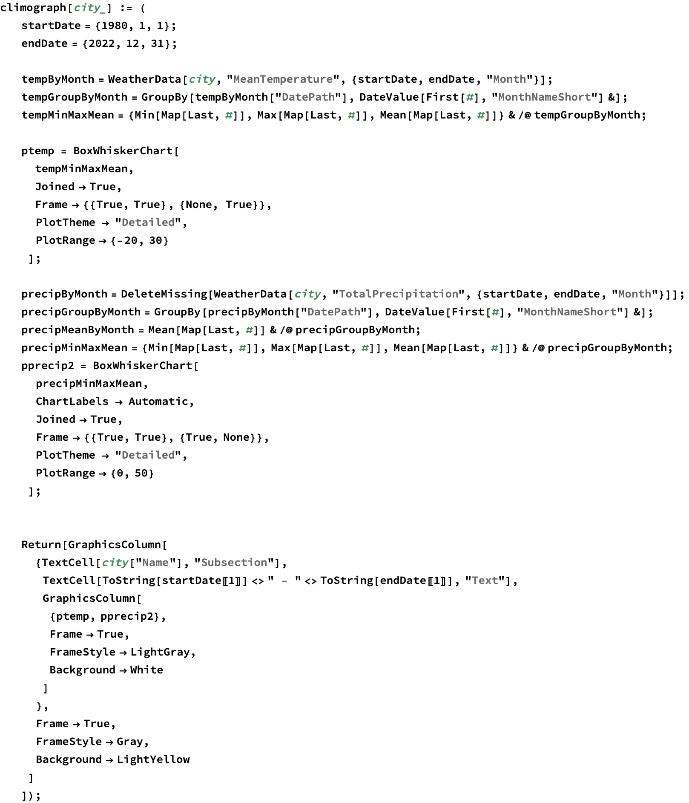
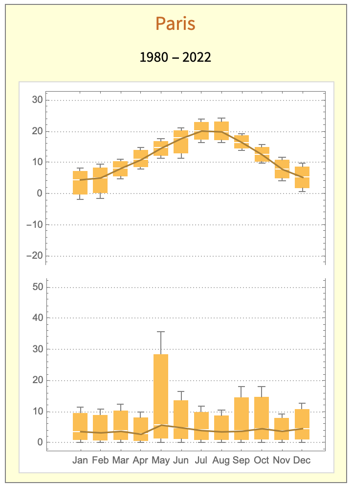
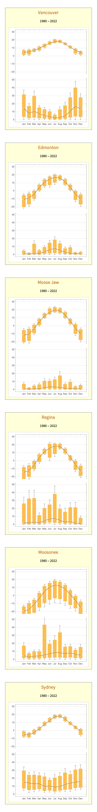

# Climograph

 Steven Black Project home: https://github.com/StevenBlack/climographs

## Introduction

 The motivation for this repository is, given a location, create its clomograph.

 See: https://en.wikipedia.org/wiki/Climograph.

 This Wolfram community forum question was very helpful: https://community.wolfram.com/groups/-/m/t/1599725

 

### Examples

 

 
<map name="map_3">
<area shape="rect" coords="300,453,317,410" title="max      12.71

75%      10.7001

median   4.67049

25%      1.16762

min      0." nohref="" />
<area shape="rect" coords="280,453,297,421" title="max      9.3

75%      7.92756

median   3.81025

25%      0.952563

min      0." nohref="" />
<area shape="rect" coords="259,453,276,393" title="max      18.04

75%      14.6942

median   4.65692

25%      1.16423

min      0." nohref="" />
<area shape="rect" coords="238,453,256,393" title="max      18.02

75%      14.4746

median   3.83821

25%      0.959551

min      0." nohref="" />
<area shape="rect" coords="218,453,235,417" title="max      10.45

75%      8.7473

median   3.63921

25%      0.909803

min      0." nohref="" />
<area shape="rect" coords="197,453,214,414" title="max      11.63

75%      9.73822

median   4.06289

25%      1.01572

min      0." nohref="" />
<area shape="rect" coords="177,453,194,398" title="max      16.51

75%      13.6238

median   4.965

25%      1.24125

min      0." nohref="" />
<area shape="rect" coords="156,453,173,337" title="max      35.86

75%      28.3458

median   5.80325

25%      1.45081

min      0." nohref="" />
<area shape="rect" coords="135,453,153,419" title="max      9.83

75%      8.08963

median   2.86854

25%      0.717134

min      0." nohref="" />
<area shape="rect" coords="115,453,132,411" title="max      12.42

75%      10.2688

median   3.81512

25%      0.95378

min      0." nohref="" />
<area shape="rect" coords="94,453,111,416" title="max      10.71

75%      8.8659

median   3.33359

25%      0.833397

min      0." nohref="" />
<area shape="rect" coords="73,453,91,414" title="max      11.44

75%      9.50969

median   3.71875

25%      0.929688

min      0." nohref="" />
<area shape="rect" coords="301,197,318,166" title="max      9.65

75%      8.58151

median   5.37605

25%      1.92901

min      0.78" nohref="" />
<area shape="rect" coords="280,186,297,159" title="max      11.72

75%      10.7694

median   7.91744

25%      4.99436

min      4.02" nohref="" />
<area shape="rect" coords="259,168,277,146" title="max      15.68

75%      14.9056

median   12.5823

25%      10.4131

min      9.69" nohref="" />
<area shape="rect" coords="239,155,256,135" title="max      19.36

75%      18.6481

median   16.5126

25%      14.5456

min      13.89" nohref="" />
<area shape="rect" coords="218,147,235,119" title="max      24.12

75%      23.0809

median   19.9635

25%      17.2609

min      16.36" nohref="" />
<area shape="rect" coords="197,147,215,120" title="max      23.86

75%      22.9548

median   20.2393

25%      17.3448

min      16.38" nohref="" />
<area shape="rect" coords="176,163,194,129" title="max      20.98

75%      20.1919

median   17.8277

25%      13.0294

min      11.43" nohref="" />
<area shape="rect" coords="156,163,173,140" title="max      17.57

75%      16.8559

median   14.7135

25%      12.1834

min      11.34" nohref="" />
<area shape="rect" coords="135,174,152,149" title="max      14.9

75%      13.9253

median   11.0012

25%      8.64529

min      7.86" nohref="" />
<area shape="rect" coords="114,184,132,161" title="max      11.06

75%      10.3509

median   8.22372

25%      5.61093

min      4.74" nohref="" />
<area shape="rect" coords="94,203,111,166" title="max      9.41

75%      8.35453

median   5.18814

25%      0.262035

min      -1.38" nohref="" />
<area shape="rect" coords="73,205,90,171" title="max      8.07

75%      7.19645

median   4.57581

25%      -0.183547

min      -1.77" nohref="" />
</map>

 

 

 
<map name="map_6">
<area shape="rect" coords="339,3395,357,3285" title="max      37.26

75%      32.0027

median   16.2309

25%      8.44523

min      5.85" nohref="" />
<area shape="rect" coords="316,3397,335,3289" title="max      36.01

75%      30.8487

median   15.3647

25%      7.94366

min      5.47" nohref="" />
<area shape="rect" coords="294,3404,313,3314" title="max      28.78

75%      25.1684

median   14.3335

25%      6.17087

min      3.45" nohref="" />
<area shape="rect" coords="272,3403,290,3303" title="max      32.09

75%      27.2312

median   12.6547

25%      5.81866

min      3.54" nohref="" />
<area shape="rect" coords="250,3405,268,3319" title="max      27.29

75%      22.9456

median   9.91233

25%      4.76558

min      3.05" nohref="" />
<area shape="rect" coords="227,3410,246,3328" title="max      24.63

75%      20.7666

median   9.17651

25%      3.54663

min      1.67" nohref="" />
<area shape="rect" coords="205,3406,224,3342" title="max      20.62

75%      18.145

median   10.72

25%      4.8325

min      2.87" nohref="" />
<area shape="rect" coords="183,3407,201,3322" title="max      26.31

75%      22.2603

median   10.1114

25%      4.28285

min      2.34" nohref="" />
<area shape="rect" coords="161,3401,179,3320" title="max      27.11

75%      23.6672

median   13.3388

25%      6.40971

min      4.1" nohref="" />
<area shape="rect" coords="138,3404,157,3316" title="max      28.1

75%      24.4558

median   13.523

25%      5.76576

min      3.18" nohref="" />
<area shape="rect" coords="116,3408,134,3318" title="max      27.57

75%      24.2374

median   14.2395

25%      5.23988

min      2.24" nohref="" />
<area shape="rect" coords="94,3400,112,3295" title="max      34.18

75%      29.5227

median   15.5507

25%      7.30017

min      4.55" nohref="" />
<area shape="rect" coords="339,3165,358,3129" title="max      2.77

75%      1.84913

median   -0.913488

25%      -5.29087

min      -6.75" nohref="" />
<area shape="rect" coords="317,3135,335,3118" title="max      6.03

75%      5.56221

median   4.15884

25%      2.35971

min      1.76" nohref="" />
<area shape="rect" coords="294,3118,313,3100" title="max      11.13

75%      10.6044

median   9.02744

25%      7.43936

min      6.91" nohref="" />
<area shape="rect" coords="272,3103,291,3077" title="max      17.78

75%      16.9549

median   14.4795

25%      12.0274

min      11.21" nohref="" />
<area shape="rect" coords="250,3087,268,3069" title="max      20.36

75%      19.8286

median   18.2344

25%      16.4011

min      15.79" nohref="" />
<area shape="rect" coords="227,3090,246,3070" title="max      20.05

75%      19.4684

median   17.7235

25%      15.5459

min      14.82" nohref="" />
<area shape="rect" coords="205,3107,224,3082" title="max      16.38

75%      15.5227

median   12.9507

25%      10.7152

min      9.97" nohref="" />
<area shape="rect" coords="183,3122,201,3099" title="max      11.52

75%      10.5744

median   7.73744

25%      6.12686

min      5.59" nohref="" />
<area shape="rect" coords="161,3142,179,3122" title="max      4.79

75%      4.21547

median   2.49186

25%      0.487965

min      -0.18" nohref="" />
<area shape="rect" coords="138,3159,157,3133" title="max      1.74

75%      0.731453

median   -2.29419

25%      -4.42105

min      -5.13" nohref="" />
<area shape="rect" coords="116,3173,134,3146" title="max      -2.29

75%      -3.00599

median   -5.15395

25%      -8.22599

min      -9.25" nohref="" />
<area shape="rect" coords="94,3171,112,3138" title="max      0.15

75%      -1.03297

median   -4.58186

25%      -7.52047

min      -8.5" nohref="" />
<area shape="rect" coords="339,2834,357,2769" title="max      18.69

75%      15.3683

median   5.40333

25%      1.59083

min      0.32" nohref="" />
<area shape="rect" coords="316,2835,335,2785" title="max      13.82

75%      11.962

median   6.3878

25%      1.70195

min      0.14" nohref="" />
<area shape="rect" coords="294,2834,313,2768" title="max      18.92

75%      16.2845

median   8.37786

25%      2.46946

min      0.5" nohref="" />
<area shape="rect" coords="272,2836,290,2769" title="max      18.71

75%      15.8926

median   7.44048

25%      1.86012

min      0." nohref="" />
<area shape="rect" coords="250,2834,268,2688" title="max      42.2

75%      33.7507

median   8.40293

25%      2.34073

min      0.32" nohref="" />
<area shape="rect" coords="227,2835,246,2731" title="max      29.77

75%      24.516

median   8.75415

25%      2.29354

min      0.14" nohref="" />
<area shape="rect" coords="205,2835,224,2753" title="max      23.37

75%      19.3804

median   7.41146

25%      2.04037

min      0.25" nohref="" />
<area shape="rect" coords="183,2836,201,2641" title="max      55.89

75%      43.4017

median   5.9369

25%      1.48423

min      0." nohref="" />
<area shape="rect" coords="161,2836,179,2792" title="max      12.

75%      10.1308

median   4.52325

25%      1.13081

min      0." nohref="" />
<area shape="rect" coords="138,2835,157,2792" title="max      11.91

75%      9.9911

median   4.23439

25%      1.0961

min      0.05" nohref="" />
<area shape="rect" coords="116,2835,134,2802" title="max      9.04

75%      7.58964

median   3.23857

25%      0.952143

min      0.19" nohref="" />
<area shape="rect" coords="94,2834,112,2760" title="max      21.15

75%      17.0924

median   4.91952

25%      1.65738

min      0.57" nohref="" />
<area shape="rect" coords="339,2656,358,2577" title="max      -5.38

75%      -7.66081

median   -14.5033

25%      -24.3408

min      -27.62" nohref="" />
<area shape="rect" coords="317,2627,335,2554" title="max      1.41

75%      -0.423895

median   -5.92558

25%      -15.8064

min      -19.1" nohref="" />
<area shape="rect" coords="294,2616,313,2530" title="max      8.4

75%      6.7114

median   1.64558

25%      -11.5661

min      -15.97" nohref="" />
<area shape="rect" coords="272,2603,291,2507" title="max      15.01

75%      13.2781

median   8.08233

25%      -7.00192

min      -12.03" nohref="" />
<area shape="rect" coords="250,2595,268,2494" title="max      18.74

75%      17.127

median   12.2879

25%      -4.27802

min      -9.8" nohref="" />
<area shape="rect" coords="227,2592,246,2488" title="max      20.57

75%      18.7975

median   13.48

25%      -3.3125

min      -8.91" nohref="" />
<area shape="rect" coords="205,2598,224,2498" title="max      17.52

75%      15.8799

median   10.9598

25%      -5.16506

min      -10.54" nohref="" />
<area shape="rect" coords="183,2610,201,2510" title="max      14.17

75%      12.0194

median   5.56767

25%      -9.19808

min      -14.12" nohref="" />
<area shape="rect" coords="161,2626,179,2540" title="max      5.52

75%      3.44483

median   -2.7807

25%      -14.7952

min      -18.8" nohref="" />
<area shape="rect" coords="138,2647,157,2570" title="max      -3.38

75%      -5.16971

median   -10.5388

25%      -21.2422

min      -24.81" nohref="" />
<area shape="rect" coords="116,2660,134,2582" title="max      -6.82

75%      -9.37459

median   -17.0384

25%      -25.7246

min      -28.62" nohref="" />
<area shape="rect" coords="94,2664,112,2599" title="max      -11.8

75%      -13.6303

median   -19.1212

25%      -27.0778

min      -29.73" nohref="" />
<area shape="rect" coords="339,2256,357,2216" title="max      10.63

75%      8.32006

median   1.39023

25%      0.347558

min      0." nohref="" />
<area shape="rect" coords="316,2256,335,2157" title="max      27.83

75%      21.3381

median   1.86233

25%      0.465581

min      0." nohref="" />
<area shape="rect" coords="294,2255,313,2159" title="max      27.27

75%      21.4191

median   3.86651

25%      1.09413

min      0.17" nohref="" />
<area shape="rect" coords="272,2256,290,2184" title="max      20.19

75%      15.949

median   3.22605

25%      0.806512

min      0." nohref="" />
<area shape="rect" coords="250,2255,268,2169" title="max      24.42

75%      19.6334

median   5.27349

25%      1.55087

min      0.31" nohref="" />
<area shape="rect" coords="227,2255,246,2087" title="max      48.23

75%      38.1344

median   7.84744

25%      2.11186

min      0.2" nohref="" />
<area shape="rect" coords="205,2252,224,2147" title="max      30.95

75%      24.9947

median   7.12884

25%      2.63721

min      1.14" nohref="" />
<area shape="rect" coords="183,2255,201,2165" title="max      25.75

75%      20.5349

median   4.88977

25%      1.37244

min      0.2" nohref="" />
<area shape="rect" coords="161,2255,179,2203" title="max      14.64

75%      11.5778

median   2.3914

25%      0.635349

min      0.05" nohref="" />
<area shape="rect" coords="138,2256,157,2106" title="max      42.78

75%      32.9282

median   3.37279

25%      0.843198

min      0." nohref="" />
<area shape="rect" coords="116,2256,134,2107" title="max      42.51

75%      32.4053

median   2.0914

25%      0.522849

min      0." nohref="" />
<area shape="rect" coords="94,2256,112,2135" title="max      34.27

75%      26.2426

median   2.16023

25%      0.540058

min      0." nohref="" />
<area shape="rect" coords="339,2054,358,1993" title="max      -4.18

75%      -6.27622

median   -12.5649

25%      -18.9887

min      -21.13" nohref="" />
<area shape="rect" coords="317,2028,335,1974" title="max      1.38

75%      -0.175698

median   -4.84279

25%      -11.3582

min      -13.53" nohref="" />
<area shape="rect" coords="294,1983,313,1955" title="max      6.86

75%      6.20157

median   4.22628

25%      0.74157

min      -0.42" nohref="" />
<area shape="rect" coords="272,1953,291,1923" title="max      16.18

75%      15.1833

median   12.193

25%      9.26576

min      8.29" nohref="" />
<area shape="rect" coords="250,1932,268,1903" title="max      22.04

75%      21.0294

median   17.9974

25%      15.2769

min      14.37" nohref="" />
<area shape="rect" coords="227,1964,246,1903" title="max      22.06

75%      21.226

median   18.7242

25%      8.54355

min      5.15" nohref="" />
<area shape="rect" coords="205,1982,224,1901" title="max      22.78

75%      21.0929

median   16.0316

25%      3.98541

min      -0.03" nohref="" />
<area shape="rect" coords="183,1955,201,1925" title="max      15.79

75%      14.7286

median   11.5444

25%      8.7586

min      7.83" nohref="" />
<area shape="rect" coords="161,1993,179,1947" title="max      9.22

75%      7.96145

median   4.18581

25%      -1.38355

min      -3.24" nohref="" />
<area shape="rect" coords="138,2025,157,1975" title="max      1.13

75%      -0.402849

median   -5.0014

25%      -10.6253

min      -12.5" nohref="" />
<area shape="rect" coords="116,2060,134,1992" title="max      -3.7

75%      -5.90221

median   -12.5088

25%      -20.1597

min      -22.71" nohref="" />
<area shape="rect" coords="94,2070,112,1999" title="max      -5.86

75%      -7.94878

median   -14.2151

25%      -22.9413

min      -25.85" nohref="" />
<area shape="rect" coords="339,1676,357,1649" title="max      7.03

75%      5.57151

median   1.19605

25%      0.299012

min      0." nohref="" />
<area shape="rect" coords="316,1676,335,1657" title="max      4.75

75%      3.81424

median   1.00698

25%      0.251744

min      0." nohref="" />
<area shape="rect" coords="294,1676,313,1631" title="max      12.17

75%      9.51378

median   1.54512

25%      0.386279

min      0." nohref="" />
<area shape="rect" coords="272,1676,290,1644" title="max      8.34

75%      6.73279

median   1.91116

25%      0.477791

min      0." nohref="" />
<area shape="rect" coords="250,1676,268,1596" title="max      22.42

75%      17.5267

median   2.84698

25%      0.711744

min      0." nohref="" />
<area shape="rect" coords="227,1676,246,1619" title="max      15.73

75%      12.6572

median   3.43884

25%      0.859709

min      0." nohref="" />
<area shape="rect" coords="205,1676,224,1628" title="max      13.21

75%      10.7862

median   3.51488

25%      0.878721

min      0." nohref="" />
<area shape="rect" coords="183,1676,201,1627" title="max      13.53

75%      10.8356

median   2.75233

25%      0.688081

min      0." nohref="" />
<area shape="rect" coords="161,1676,179,1645" title="max      8.11

75%      6.3861

median   1.21442

25%      0.303605

min      0." nohref="" />
<area shape="rect" coords="138,1676,157,1652" title="max      6.

75%      4.7857

median   1.14279

25%      0.285698

min      0." nohref="" />
<area shape="rect" coords="116,1676,134,1663" title="max      2.82

75%      2.27209

median   0.628372

25%      0.157093

min      0." nohref="" />
<area shape="rect" coords="94,1676,112,1642" title="max      8.96

75%      7.00744

median   1.14977

25%      0.287442

min      0." nohref="" />
<area shape="rect" coords="339,1471,358,1408" title="max      -2.64

75%      -4.53576

median   -10.223

25%      -17.7208

min      -20.22" nohref="" />
<area shape="rect" coords="317,1444,335,1386" title="max      3.76

75%      2.06703

median   -3.01186

25%      -10.023

min      -12.36" nohref="" />
<area shape="rect" coords="294,1398,313,1367" title="max      9.35

75%      8.44291

median   5.72163

25%      2.33041

min      1.2" nohref="" />
<area shape="rect" coords="272,1371,291,1336" title="max      18.19

75%      17.0032

median   13.4428

25%      10.0357

min      8.9" nohref="" />
<area shape="rect" coords="250,1348,268,1320" title="max      22.93

75%      21.9616

median   19.0563

25%      16.4416

min      15.57" nohref="" />
<area shape="rect" coords="227,1345,246,1316" title="max      24.16

75%      23.1531

median   20.1323

25%      17.3781

min      16.46" nohref="" />
<area shape="rect" coords="205,1354,224,1320" title="max      23.12

75%      21.6642

median   17.297

25%      14.6592

min      13.78" nohref="" />
<area shape="rect" coords="183,1370,201,1343" title="max      16.36

75%      15.3892

median   12.4767

25%      9.97419

min      9.14" nohref="" />
<area shape="rect" coords="161,1403,179,1366" title="max      9.68

75%      8.60151

median   5.36605

25%      1.09401

min      -0.33" nohref="" />
<area shape="rect" coords="138,1440,157,1389" title="max      2.87

75%      1.36721

median   -3.14116

25%      -9.08779

min      -11.07" nohref="" />
<area shape="rect" coords="116,1476,134,1405" title="max      -1.66

75%      -3.76436

median   -10.0774

25%      -18.7794

min      -21.68" nohref="" />
<area shape="rect" coords="94,1483,112,1410" title="max      -3.31

75%      -5.35849

median   -11.504

25%      -20.531

min      -23.54" nohref="" />
<area shape="rect" coords="339,1096,357,1080" title="max      3.87

75%      3.22833

median   1.30333

25%      0.325833

min      0." nohref="" />
<area shape="rect" coords="316,1096,335,1082" title="max      3.15

75%      2.70258

median   1.36031

25%      0.340078

min      0." nohref="" />
<area shape="rect" coords="294,1096,313,1054" title="max      11.5

75%      9.11904

median   1.97618

25%      0.494044

min      0." nohref="" />
<area shape="rect" coords="272,1096,290,1061" title="max      9.33

75%      7.78866

median   3.16465

25%      0.791163

min      0." nohref="" />
<area shape="rect" coords="250,1096,268,1035" title="max      16.87

75%      13.9961

median   5.37452

25%      1.34363

min      0." nohref="" />
<area shape="rect" coords="227,1096,246,1016" title="max      22.35

75%      18.7888

median   8.10524

25%      2.02631

min      0." nohref="" />
<area shape="rect" coords="205,1096,224,1032" title="max      17.67

75%      14.8374

median   6.33952

25%      1.58488

min      0." nohref="" />
<area shape="rect" coords="183,1096,201,1054" title="max      11.34

75%      9.46173

median   3.8269

25%      0.956726

min      0." nohref="" />
<area shape="rect" coords="161,1096,179,1071" title="max      6.49

75%      5.24609

median   1.51438

25%      0.378594

min      0." nohref="" />
<area shape="rect" coords="138,1096,157,1033" title="max      17.49

75%      13.6217

median   2.01697

25%      0.504242

min      0." nohref="" />
<area shape="rect" coords="116,1096,134,1084" title="max      2.54

75%      2.10864

median   0.814571

25%      0.203643

min      0." nohref="" />
<area shape="rect" coords="94,1096,112,1072" title="max      6.1

75%      4.91652

median   1.36606

25%      0.341515

min      0." nohref="" />
<area shape="rect" coords="339,888,358,828" title="max      -2.71

75%      -4.48895

median   -9.82581

25%      -16.819

min      -19.15" nohref="" />
<area shape="rect" coords="317,869,335,815" title="max      1.13

75%      -0.192733

median   -4.16093

25%      -11.2552

min      -13.62" nohref="" />
<area shape="rect" coords="294,822,313,789" title="max      8.61

75%      7.57953

median   4.48814

25%      1.08453

min      -0.05" nohref="" />
<area shape="rect" coords="272,799,291,765" title="max      15.69

75%      14.5785

median   11.2442

25%      7.74605

min      6.58" nohref="" />
<area shape="rect" coords="250,778,268,750" title="max      20.07

75%      19.1484

median   16.3837

25%      13.7709

min      12.9" nohref="" />
<area shape="rect" coords="227,794,246,746" title="max      21.15

75%      20.206

median   17.374

25%      10.4785

min      8.18" nohref="" />
<area shape="rect" coords="205,806,224,755" title="max      18.66

75%      17.7478

median   15.0112

25%      7.27029

min      4.69" nohref="" />
<area shape="rect" coords="183,808,201,766" title="max      15.42

75%      14.3688

median   11.2151

25%      5.86378

min      4.08" nohref="" />
<area shape="rect" coords="161,824,179,789" title="max      8.61

75%      7.60552

median   4.59209

25%      0.683023

min      -0.62" nohref="" />
<area shape="rect" coords="138,862,157,814" title="max      1.56

75%      0.275174

median   -3.5793

25%      -9.66983

min      -11.7" nohref="" />
<area shape="rect" coords="116,889,134,824" title="max      -1.44

75%      -3.26988

median   -8.75953

25%      -16.8899

min      -19.6" nohref="" />
<area shape="rect" coords="94,902,112,831" title="max      -3.55

75%      -5.27773

median   -10.4609

25%      -20.1952

min      -23.44" nohref="" />
<area shape="rect" coords="339,516,357,401" title="max      32.64

75%      27.9016

median   13.6865

25%      3.42163

min      0." nohref="" />
<area shape="rect" coords="316,516,335,349" title="max      48.

75%      40.2491

median   16.9965

25%      4.24913

min      0." nohref="" />
<area shape="rect" coords="294,516,313,398" title="max      33.64

75%      27.9427

median   10.8509

25%      2.71273

min      0." nohref="" />
<area shape="rect" coords="272,516,290,438" title="max      22.02

75%      17.7881

median   5.09233

25%      1.27308

min      0." nohref="" />
<area shape="rect" coords="250,516,268,458" title="max      16.17

75%      12.8667

median   2.95698

25%      0.739244

min      0." nohref="" />
<area shape="rect" coords="227,516,246,488" title="max      7.3

75%      6.05523

median   2.32093

25%      0.580233

min      0." nohref="" />
<area shape="rect" coords="205,516,224,470" title="max      12.57

75%      10.4487

median   4.08488

25%      1.02122

min      0." nohref="" />
<area shape="rect" coords="183,516,201,460" title="max      15.52

75%      13.0244

median   5.53767

25%      1.38442

min      0." nohref="" />
<area shape="rect" coords="161,516,179,452" title="max      17.88

75%      15.2486

median   7.35429

25%      1.83857

min      0." nohref="" />
<area shape="rect" coords="138,516,157,390" title="max      35.96

75%      29.6864

median   10.8657

25%      2.71643

min      0." nohref="" />
<area shape="rect" coords="116,516,134,444" title="max      20.28

75%      17.1847

median   7.89881

25%      1.9747

min      0." nohref="" />
<area shape="rect" coords="94,516,112,385" title="max      37.26

75%      31.5745

median   14.5179

25%      3.62948

min      0." nohref="" />
<area shape="rect" coords="339,239,358,218" title="max      6.28

75%      5.87116

median   4.64465

25%      1.79116

min      0.84" nohref="" />
<area shape="rect" coords="317,236,335,206" title="max      9.52

75%      8.93895

median   7.19581

25%      3.14145

min      1.79" nohref="" />
<area shape="rect" coords="294,210,313,195" title="max      12.94

75%      12.4374

median   10.9295

25%      9.81988

min      9.45" nohref="" />
<area shape="rect" coords="272,194,291,182" title="max      16.76

75%      16.3862

median   15.2647

25%      14.1887

min      13.83" nohref="" />
<area shape="rect" coords="250,186,268,170" title="max      20.12

75%      19.6932

median   18.4128

25%      16.8957

min      16.39" nohref="" />
<area shape="rect" coords="227,187,246,167" title="max      21.1

75%      20.4167

median   18.3667

25%      16.5092

min      15.89" nohref="" />
<area shape="rect" coords="205,194,224,175" title="max      18.56

75%      17.8892

median   15.8767

25%      14.4617

min      13.99" nohref="" />
<area shape="rect" coords="183,208,201,187" title="max      15.28

75%      14.752

median   13.1679

25%      10.822

min      10.04" nohref="" />
<area shape="rect" coords="161,221,179,197" title="max      12.24

75%      11.6322

median   9.80884

25%      7.01221

min      6.08" nohref="" />
<area shape="rect" coords="138,225,157,207" title="max      9.4

75%      8.87744

median   7.30977

25%      5.47244

min      4.86" nohref="" />
<area shape="rect" coords="116,240,134,210" title="max      8.36

75%      7.61413

median   5.37651

25%      1.80163

min      0.61" nohref="" />
<area shape="rect" coords="94,240,112,212" title="max      7.8

75%      7.07081

median   4.88326

25%      1.55081

min      0.44" nohref="" />
</map>

 <a href="http://www.wolfram.com/language/" style="color:#000; text-decoration:none;">
  Created with the Wolfram Language 
 </a>

