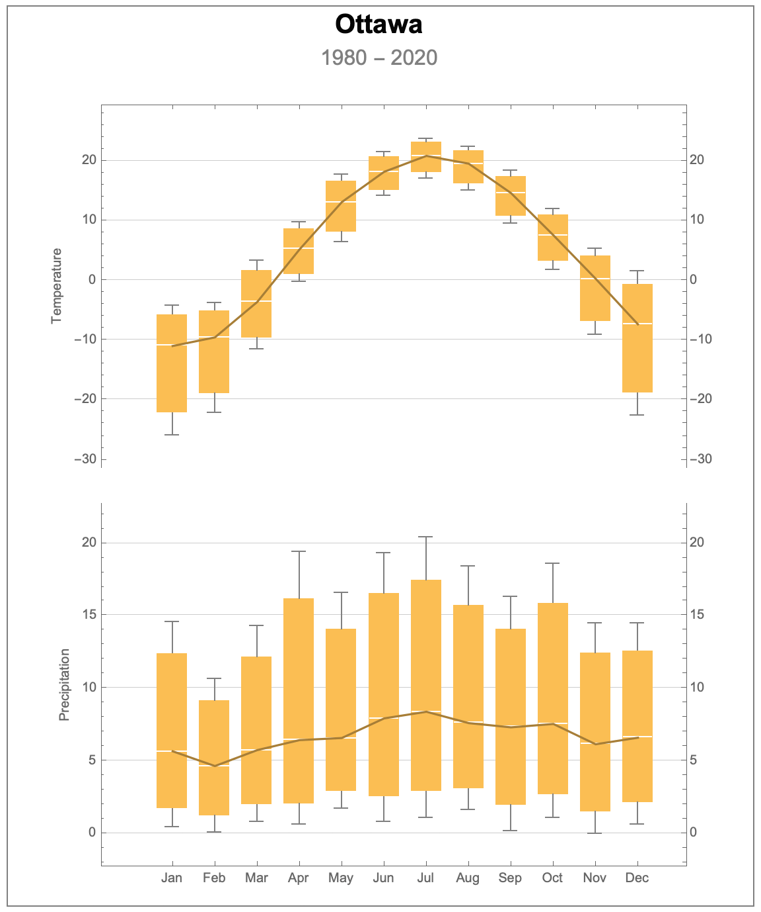
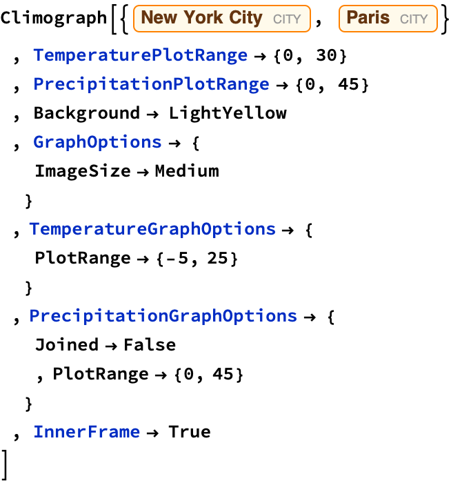
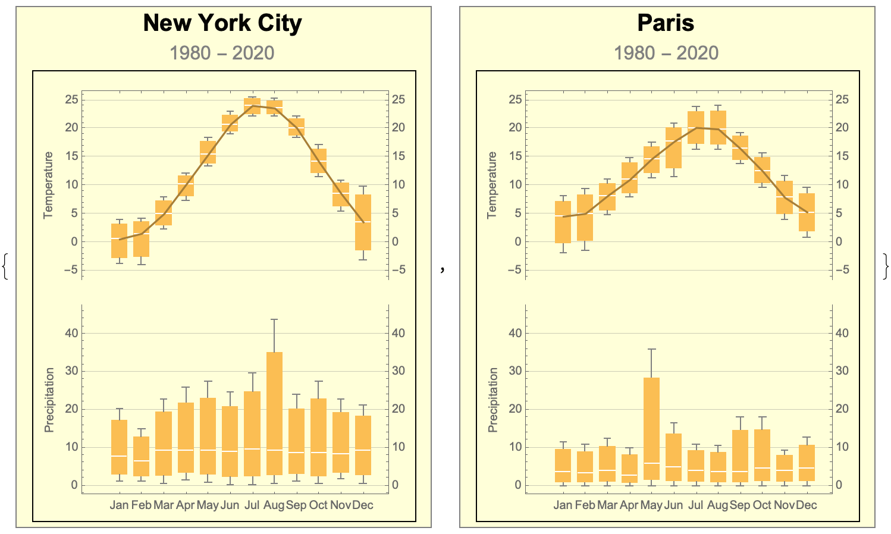
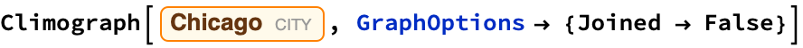
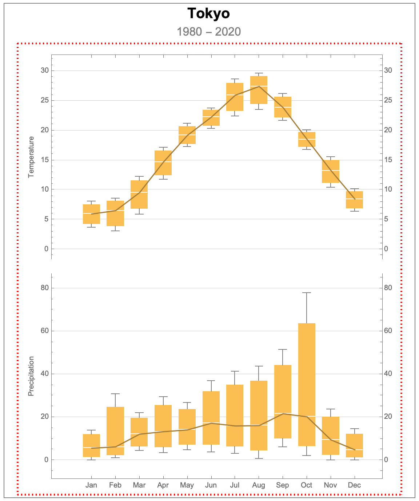
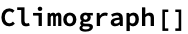

# Climograph

 Steven Black Project home: https://github.com/StevenBlack/climograph

## Introduction

 The motivation for this repository is, given a location, create its clomograph.

 See: https://en.wikipedia.org/wiki/Climograph.

## Definition

 

## Live Examples

### Example 1: default climograph

 This call with a City Entity with no options produces a default climograph.

 

 
<map name="map_3">
<area shape="rect" coords="470,624,495,469" title="max      14.52

75%      12.546

median   6.62415

25%      2.14354

min      0.65" nohref="" />
<area shape="rect" coords="438,631,463,469" title="max      14.5

75%      12.4182

median   6.17293

25%      1.54323

min      0." nohref="" />
<area shape="rect" coords="406,619,431,424" title="max      18.58

75%      15.8278

median   7.57122

25%      2.7028

min      1.08" nohref="" />
<area shape="rect" coords="374,628,399,449" title="max      16.28

75%      14.0446

median   7.33829

25%      1.99957

min      0.22" nohref="" />
<area shape="rect" coords="342,613,367,426" title="max      18.38

75%      15.6924

median   7.62951

25%      3.10738

min      1.6" nohref="" />
<area shape="rect" coords="310,619,335,404" title="max      20.43

75%      17.4254

median   8.41171

25%      2.92793

min      1.1" nohref="" />
<area shape="rect" coords="278,622,303,416" title="max      19.35

75%      16.5012

median   7.95488

25%      2.58122

min      0.79" nohref="" />
<area shape="rect" coords="246,612,271,446" title="max      16.57

75%      14.0783

median   6.60317

25%      2.94079

min      1.72" nohref="" />
<area shape="rect" coords="214,624,239,415" title="max      19.39

75%      16.1571

median   6.45854

25%      2.07213

min      0.61" nohref="" />
<area shape="rect" coords="182,622,207,472" title="max      14.27

75%      12.1449

median   5.76951

25%      2.03488

min      0.79" nohref="" />
<area shape="rect" coords="150,630,175,511" title="max      10.65

75%      9.15549

median   4.67195

25%      1.25799

min      0.12" nohref="" />
<area shape="rect" coords="118,626,143,468" title="max      14.61

75%      12.3801

median   5.69049

25%      1.76762

min      0.46" nohref="" />
<area shape="rect" coords="470,315,495,203" title="max      1.53

75%      -0.677622

median   -7.30049

25%      -18.6926

min      -22.49" nohref="" />
<area shape="rect" coords="438,254,463,186" title="max      5.24

75%      4.01189

median   0.327561

25%      -6.78811

min      -9.16" nohref="" />
<area shape="rect" coords="406,204,431,156" title="max      12.03

75%      10.9232

median   7.60268

25%      3.31067

min      1.88" nohref="" />
<area shape="rect" coords="374,170,399,127" title="max      18.29

75%      17.3772

median   14.6388

25%      10.8072

min      9.53" nohref="" />
<area shape="rect" coords="342,145,367,109" title="max      22.39

75%      21.6827

median   19.561

25%      16.2152

min      15.1" nohref="" />
<area shape="rect" coords="310,136,335,103" title="max      23.79

75%      23.0584

median   20.8637

25%      18.0484

min      17.11" nohref="" />
<area shape="rect" coords="278,149,303,113" title="max      21.5

75%      20.6749

median   18.1998

25%      15.1624

min      14.15" nohref="" />
<area shape="rect" coords="246,184,271,130" title="max      17.76

75%      16.6049

median   13.1395

25%      8.09238

min      6.41" nohref="" />
<area shape="rect" coords="214,214,239,166" title="max      9.69

75%      8.57372

median   5.22488

25%      1.11122

min      -0.26" nohref="" />
<area shape="rect" coords="182,265,207,195" title="max      3.41

75%      1.66659

median   -3.56366

25%      -9.58341

min      -11.59" nohref="" />
<area shape="rect" coords="150,313,175,227" title="max      -3.7

75%      -5.14494

median   -9.47976

25%      -18.8999

min      -22.04" nohref="" />
<area shape="rect" coords="118,330,143,229" title="max      -4.13

75%      -5.82805

median   -10.9222

25%      -22.0805

min      -25.8" nohref="" />
</map>

### Example 2: normalizing scales across climographs

 This call uses options to set the background color, and normalizes the vertical ranges for both the temperature and precipitation plots .

 

 
<map name="map_5">
<area shape="rect" coords="670,409,686,366" title="max      12.71

75%      10.6757

median   4.57282

25%      1.14321

min      0." nohref="" />
<area shape="rect" coords="652,409,667,377" title="max      9.3

75%      7.92632

median   3.80526

25%      0.951316

min      0." nohref="" />
<area shape="rect" coords="633,409,649,349" title="max      18.04

75%      14.6893

median   4.6373

25%      1.15932

min      0." nohref="" />
<area shape="rect" coords="614,409,630,349" title="max      18.02

75%      14.4482

median   3.73297

25%      0.933243

min      0." nohref="" />
<area shape="rect" coords="596,409,612,373" title="max      10.45

75%      8.77243

median   3.73972

25%      0.934931

min      0." nohref="" />
<area shape="rect" coords="577,409,593,372" title="max      10.99

75%      9.22764

median   3.94056

25%      0.985139

min      0." nohref="" />
<area shape="rect" coords="558,409,574,354" title="max      16.51

75%      13.589

median   4.82583

25%      1.20646

min      0." nohref="" />
<area shape="rect" coords="540,409,556,292" title="max      35.86

75%      28.3655

median   5.88184

25%      1.47046

min      0." nohref="" />
<area shape="rect" coords="521,409,537,375" title="max      9.83

75%      8.07276

median   2.80103

25%      0.700256

min      0." nohref="" />
<area shape="rect" coords="503,409,518,367" title="max      12.42

75%      10.2819

median   3.86744

25%      0.966859

min      0." nohref="" />
<area shape="rect" coords="484,409,500,372" title="max      10.71

75%      8.85919

median   3.30676

25%      0.826689

min      0." nohref="" />
<area shape="rect" coords="465,409,481,370" title="max      11.44

75%      9.48145

median   3.60579

25%      0.901447

min      0." nohref="" />
<area shape="rect" coords="670,201,686,156" title="max      9.65

75%      8.57305

median   5.3422

25%      1.92055

min      0.78" nohref="" />
<area shape="rect" coords="652,186,667,146" title="max      11.72

75%      10.7649

median   7.89951

25%      4.98988

min      4.02" nohref="" />
<area shape="rect" coords="633,159,649,127" title="max      15.68

75%      14.8902

median   12.5207

25%      10.3977

min      9.69" nohref="" />
<area shape="rect" coords="614,139,630,110" title="max      19.36

75%      18.6371

median   16.4683

25%      14.5346

min      13.89" nohref="" />
<area shape="rect" coords="596,127,612,87" title="max      24.12

75%      23.0732

median   19.9327

25%      17.2532

min      16.36" nohref="" />
<area shape="rect" coords="577,127,593,88" title="max      23.86

75%      22.9446

median   20.1983

25%      17.3346

min      16.38" nohref="" />
<area shape="rect" coords="558,150,574,102" title="max      20.98

75%      20.1701

median   17.7402

25%      13.0076

min      11.43" nohref="" />
<area shape="rect" coords="540,151,556,118" title="max      17.57

75%      16.8551

median   14.7102

25%      12.1826

min      11.34" nohref="" />
<area shape="rect" coords="521,167,537,131" title="max      14.9

75%      13.935

median   11.04

25%      8.655

min      7.86" nohref="" />
<area shape="rect" coords="503,182,518,149" title="max      11.06

75%      10.3446

median   8.19829

25%      5.60457

min      4.74" nohref="" />
<area shape="rect" coords="484,212,500,157" title="max      9.41

75%      8.3272

median   5.07878

25%      0.234695

min      -1.38" nohref="" />
<area shape="rect" coords="465,213,481,164" title="max      8.07

75%      7.19561

median   4.57244

25%      -0.18439

min      -1.77" nohref="" />
<area shape="rect" coords="297,408,313,339" title="max      21.21

75%      18.2195

median   9.24805

25%      2.71701

min      0.54" nohref="" />
<area shape="rect" coords="279,404,294,334" title="max      22.79

75%      19.1977

median   8.42073

25%      3.33518

min      1.64" nohref="" />
<area shape="rect" coords="260,408,276,319" title="max      27.61

75%      22.8359

median   8.51341

25%      2.50335

min      0.5" nohref="" />
<area shape="rect" coords="241,406,257,330" title="max      24.15

75%      20.2376

median   8.50049

25%      3.04012

min      1.22" nohref="" />
<area shape="rect" coords="223,408,239,267" title="max      43.71

75%      35.1257

median   9.37268

25%      2.75567

min      0.55" nohref="" />
<area shape="rect" coords="204,409,220,312" title="max      29.73

75%      24.6722

median   9.49878

25%      2.3897

min      0.02" nohref="" />
<area shape="rect" coords="185,409,201,328" title="max      24.8

75%      20.8544

median   9.01756

25%      2.26939

min      0.02" nohref="" />
<area shape="rect" coords="167,407,183,319" title="max      27.46

75%      22.9513

median   9.42512

25%      2.91128

min      0.74" nohref="" />
<area shape="rect" coords="148,405,164,324" title="max      25.89

75%      21.7263

median   9.23537

25%      3.32884

min      1.36" nohref="" />
<area shape="rect" coords="130,408,145,334" title="max      22.74

75%      19.3341

median   9.11634

25%      2.67659

min      0.53" nohref="" />
<area shape="rect" coords="111,406,127,359" title="max      14.98

75%      12.8215

median   6.3461

25%      2.50902

min      1.23" nohref="" />
<area shape="rect" coords="92,406,108,342" title="max      20.27

75%      17.155

median   7.81

25%      2.8525

min      1.2" nohref="" />
<area shape="rect" coords="297,220,313,155" title="max      9.86

75%      8.28939

median   3.57756

25%      -1.44561

min      -3.12" nohref="" />
<area shape="rect" coords="279,179,294,150" title="max      10.97

75%      10.373

median   8.58195

25%      6.29299

min      5.53" nohref="" />
<area shape="rect" coords="260,150,276,121" title="max      17.08

75%      16.3554

median   14.1815

25%      12.1629

min      11.49" nohref="" />
<area shape="rect" coords="241,117,257,96" title="max      22.25

75%      21.7211

median   20.1344

25%      18.8261

min      18.39" nohref="" />
<area shape="rect" coords="223,99,239,81" title="max      25.27

75%      24.8595

median   23.6278

25%      22.557

min      22.2" nohref="" />
<area shape="rect" coords="204,99,220,80" title="max      25.62

75%      25.2343

median   24.0773

25%      22.6093

min      22.12" nohref="" />
<area shape="rect" coords="185,114,201,93" title="max      22.94

75%      22.3923

median   20.7493

25%      19.4823

min      19.06" nohref="" />
<area shape="rect" coords="167,141,183,114" title="max      18.49

75%      17.7341

median   15.4666

25%      13.9016

min      13.38" nohref="" />
<area shape="rect" coords="148,170,164,144" title="max      12.18

75%      11.6824

median   10.1895

25%      8.08988

min      7.39" nohref="" />
<area shape="rect" coords="130,194,145,164" title="max      8.01

75%      7.26317

median   5.02268

25%      3.00317

min      2.33" nohref="" />
<area shape="rect" coords="111,224,127,182" title="max      4.24

75%      3.57244

median   1.56976

25%      -2.56256

min      -3.94" nohref="" />
<area shape="rect" coords="92,223,108,183" title="max      4.01

75%      3.15183

median   0.577317

25%      -2.72067

min      -3.82" nohref="" />
</map>

### Example 3: omit joining bars

 This call uses options to omit the lines joining temperature and precipitation mean values .

 

 
<map name="map_7">
<area shape="rect" coords="470,631,495,524" title="max      11.58

75%      9.30086

median   2.46343

25%      0.615857

min      0." nohref="" />
<area shape="rect" coords="438,631,463,528" title="max      11.07

75%      9.13331

median   3.32324

25%      0.830809

min      0." nohref="" />
<area shape="rect" coords="406,631,431,472" title="max      17.28

75%      14.1546

median   4.77829

25%      1.19457

min      0." nohref="" />
<area shape="rect" coords="374,631,399,433" title="max      21.6

75%      17.1623

median   3.84917

25%      0.962292

min      0." nohref="" />
<area shape="rect" coords="342,631,367,433" title="max      21.59

75%      17.6476

median   5.82029

25%      1.45507

min      0." nohref="" />
<area shape="rect" coords="310,631,335,404" title="max      24.83

75%      19.7261

median   4.41444

25%      1.10361

min      0." nohref="" />
<area shape="rect" coords="278,631,303,434" title="max      21.46

75%      17.3749

median   5.11972

25%      1.27993

min      0." nohref="" />
<area shape="rect" coords="246,631,271,448" title="max      19.97

75%      16.3758

median   5.59324

25%      1.39831

min      0." nohref="" />
<area shape="rect" coords="214,631,239,481" title="max      16.27

75%      13.3667

median   4.65667

25%      1.16417

min      0." nohref="" />
<area shape="rect" coords="182,631,207,506" title="max      13.55

75%      10.7818

median   2.47722

25%      0.619306

min      0." nohref="" />
<area shape="rect" coords="150,631,175,547" title="max      9.01

75%      7.22115

median   1.85459

25%      0.463649

min      0." nohref="" />
<area shape="rect" coords="118,631,143,558" title="max      7.79

75%      6.37993

median   2.14973

25%      0.537432

min      0." nohref="" />
<area shape="rect" coords="470,321,495,238" title="max      5.14

75%      3.63268

median   -0.889268

25%      -6.24482

min      -8.03" nohref="" />
<area shape="rect" coords="438,263,463,207" title="max      10.18

75%      9.01018

median   5.50073

25%      2.51518

min      1.52" nohref="" />
<area shape="rect" coords="406,220,431,173" title="max      15.82

75%      14.9429

median   12.3117

25%      9.53543

min      8.61" nohref="" />
<area shape="rect" coords="374,175,399,135" title="max      22.06

75%      21.3657

median   19.2829

25%      16.7607

min      15.92" nohref="" />
<area shape="rect" coords="342,146,367,106" title="max      26.75

75%      25.8895

median   23.3078

25%      21.352

min      20.7" nohref="" />
<area shape="rect" coords="310,141,335,103" title="max      27.38

75%      26.5952

median   24.241

25%      22.2602

min      21.6" nohref="" />
<area shape="rect" coords="278,164,303,121" title="max      24.3

75%      23.5715

median   21.3859

25%      18.689

min      17.79" nohref="" />
<area shape="rect" coords="246,195,271,148" title="max      19.84

75%      18.853

median   15.8922

25%      13.4455

min      12.63" nohref="" />
<area shape="rect" coords="214,243,239,192" title="max      12.7

75%      11.972

median   9.78805

25%      5.98701

min      4.72" nohref="" />
<area shape="rect" coords="182,277,207,201" title="max      11.28

75%      9.39567

median   3.74268

25%      0.298171

min      -0.85" nohref="" />
<area shape="rect" coords="150,317,175,246" title="max      3.86

75%      2.46201

median   -1.73195

25%      -5.93799

min      -7.34" nohref="" />
<area shape="rect" coords="118,330,143,254" title="max      2.42

75%      0.919207

median   -3.58317

25%      -7.99829

min      -9.47" nohref="" />
</map>

### Example 4: omit the outer frame

 This call uses options to not show an outer frame, and applies a custom styles to the location and year range.

 

 
<map name="map_9">
<area shape="rect" coords="290,415,306,345" title="max      26.87

75%      22.3996

median   8.98829

25%      2.47207

min      0.3" nohref="" />
<area shape="rect" coords="271,414,287,324" title="max      35.62

75%      28.632

median   7.66805

25%      2.40451

min      0.65" nohref="" />
<area shape="rect" coords="252,414,268,281" title="max      52.6

75%      41.3405

median   7.5622

25%      2.20555

min      0.42" nohref="" />
<area shape="rect" coords="234,415,250,378" title="max      13.91

75%      11.3887

median   3.82463

25%      0.971159

min      0.02" nohref="" />
<area shape="rect" coords="215,415,231,315" title="max      39.18

75%      30.2576

median   3.49025

25%      0.872563

min      0." nohref="" />
<area shape="rect" coords="196,415,212,357" title="max      22.32

75%      17.3577

median   2.47098

25%      0.617744

min      0." nohref="" />
<area shape="rect" coords="177,415,193,338" title="max      29.82

75%      23.2235

median   3.43415

25%      0.858537

min      0." nohref="" />
<area shape="rect" coords="159,415,175,359" title="max      21.36

75%      17.0313

median   4.04537

25%      1.04884

min      0.05" nohref="" />
<area shape="rect" coords="140,414,156,380" title="max      13.2

75%      10.9637

median   4.25463

25%      1.43866

min      0.5" nohref="" />
<area shape="rect" coords="121,414,137,374" title="max      15.25

75%      12.8639

median   5.70561

25%      1.8539

min      0.57" nohref="" />
<area shape="rect" coords="102,413,118,351" title="max      24.53

75%      20.0292

median   6.52683

25%      2.41921

min      1.05" nohref="" />
<area shape="rect" coords="84,413,100,356" title="max      22.46

75%      18.7689

median   7.69561

25%      2.6964

min      1.03" nohref="" />
<area shape="rect" coords="290,219,306,182" title="max      11.3

75%      10.5556

median   8.32244

25%      5.34311

min      4.35" nohref="" />
<area shape="rect" coords="271,204,287,156" title="max      16.65

75%      15.4877

median   12.001

25%      8.61024

min      7.48" nohref="" />
<area shape="rect" coords="252,173,268,138" title="max      20.29

75%      19.3863

median   16.6751

25%      14.4363

min      13.69" nohref="" />
<area shape="rect" coords="234,151,250,118" title="max      24.32

75%      23.5584

median   21.2737

25%      18.9909

min      18.23" nohref="" />
<area shape="rect" coords="215,135,231,101" title="max      27.95

75%      27.1975

median   24.94

25%      22.4125

min      21.57" nohref="" />
<area shape="rect" coords="196,133,212,103" title="max      27.44

75%      26.7754

median   24.7815

25%      22.6129

min      21.89" nohref="" />
<area shape="rect" coords="177,143,193,114" title="max      25.16

75%      24.422

median   22.208

25%      20.462

min      19.88" nohref="" />
<area shape="rect" coords="159,170,175,139" title="max      20.05

75%      19.3579

median   17.2815

25%      15.0679

min      14.33" nohref="" />
<area shape="rect" coords="140,196,156,157" title="max      16.47

75%      15.4513

median   12.3954

25%      9.88634

min      9.05" nohref="" />
<area shape="rect" coords="121,223,137,176" title="max      12.44

75%      11.3869

median   8.22756

25%      4.65189

min      3.46" nohref="" />
<area shape="rect" coords="102,235,118,188" title="max      10.17

75%      9.17488

median   6.18951

25%      2.37238

min      1.1" nohref="" />
<area shape="rect" coords="84,224,100,193" title="max      9.09

75%      8.35823

median   6.16293

25%      4.06823

min      3.37" nohref="" />
</map>

### Example 5: styling the inner frame

 This call uses options to show the inner frame with a particular style.

 

 
<map name="map_11">
<area shape="rect" coords="474,634,500,588" title="max      14.52

75%      12.1074

median   4.86951

25%      1.21738

min      0." nohref="" />
<area shape="rect" coords="442,634,467,561" title="max      23.64

75%      20.1073

median   9.50927

25%      2.41482

min      0.05" nohref="" />
<area shape="rect" coords="409,628,435,401" title="max      77.98

75%      63.5479

median   20.2515

25%      6.51787

min      1.94" nohref="" />
<area shape="rect" coords="376,615,402,479" title="max      51.55

75%      44.0855

median   21.692

25%      10.1105

min      6.25" nohref="" />
<area shape="rect" coords="343,632,369,502" title="max      43.78

75%      36.8713

median   16.1454

25%      4.52384

min      0.65" nohref="" />
<area shape="rect" coords="310,625,336,509" title="max      41.27

75%      34.9505

median   15.992

25%      6.34549

min      3.13" nohref="" />
<area shape="rect" coords="277,623,303,522" title="max      36.81

75%      31.9216

median   17.2566

25%      7.14915

min      3.78" nohref="" />
<area shape="rect" coords="244,620,270,552" title="max      26.85

75%      23.672

median   14.1378

25%      7.19445

min      4.88" nohref="" />
<area shape="rect" coords="211,623,237,544" title="max      29.62

75%      25.5449

median   13.3195

25%      5.98488

min      3.54" nohref="" />
<area shape="rect" coords="178,621,204,566" title="max      22.12

75%      19.6298

median   12.159

25%      6.33226

min      4.39" nohref="" />
<area shape="rect" coords="146,631,171,540" title="max      30.78

75%      24.6499

median   6.25951

25%      2.27738

min      0.95" nohref="" />
<area shape="rect" coords="113,634,139,590" title="max      14.01

75%      11.9095

median   5.6078

25%      1.43945

min      0.05" nohref="" />
<area shape="rect" coords="474,292,500,258" title="max      10.15

75%      9.73476

median   8.48902

25%      6.91476

min      6.39" nohref="" />
<area shape="rect" coords="442,259,467,214" title="max      15.54

75%      14.9763

median   13.2851

25%      11.1663

min      10.46" nohref="" />
<area shape="rect" coords="409,206,435,177" title="max      20.09

75%      19.6998

median   18.5293

25%      17.2548

min      16.83" nohref="" />
<area shape="rect" coords="376,167,402,127" title="max      26.17

75%      25.5932

median   23.8629

25%      22.1957

min      21.64" nohref="" />
<area shape="rect" coords="343,152,369,99" title="max      29.63

75%      29.0795

median   27.4278

25%      24.437

min      23.44" nohref="" />
<area shape="rect" coords="310,161,336,108" title="max      28.58

75%      27.9216

median   25.9466

25%      23.3016

min      22.42" nohref="" />
<area shape="rect" coords="277,178,303,147" title="max      23.8

75%      23.4147

median   22.2588

25%      20.7672

min      20.27" nohref="" />
<area shape="rect" coords="244,203,270,168" title="max      21.15

75%      20.6621

median   19.1983

25%      17.7521

min      17.27" nohref="" />
<area shape="rect" coords="211,248,237,201" title="max      17.2

75%      16.5792

median   14.7168

25%      12.4542

min      11.7" nohref="" />
<area shape="rect" coords="178,296,204,241" title="max      12.21

75%      11.5502

median   9.57098

25%      6.81024

min      5.89" nohref="" />
<area shape="rect" coords="146,319,171,271" title="max      8.62

75%      8.09939

median   6.53756

25%      3.90689

min      3.03" nohref="" />
<area shape="rect" coords="113,314,139,276" title="max      8.04

75%      7.52299

median   5.97195

25%      4.29049

min      3.73" nohref="" />
</map>

### Example 6: set the axis labels for temperature and precipitation

 

 
<map name="map_13">
<area shape="rect" coords="474,634,500,509" title="max      13.81

75%      11.3732

median   4.06293

25%      1.03073

min      0.02" nohref="" />
<area shape="rect" coords="442,633,467,401" title="max      25.98

75%      20.8095

median   5.2978

25%      1.39945

min      0.1" nohref="" />
<area shape="rect" coords="409,634,435,468" title="max      18.41

75%      15.1413

median   5.33512

25%      1.33378

min      0." nohref="" />
<area shape="rect" coords="376,634,402,557" title="max      8.36

75%      6.78707

median   2.06829

25%      0.517073

min      0." nohref="" />
<area shape="rect" coords="343,634,369,534" title="max      11.

75%      8.56037

median   1.24146

25%      0.310366

min      0." nohref="" />
<area shape="rect" coords="310,634,336,573" title="max      6.53

75%      5.16549

median   1.07195

25%      0.267988

min      0." nohref="" />
<area shape="rect" coords="277,634,303,544" title="max      9.82

75%      7.80085

median   1.74341

25%      0.435854

min      0." nohref="" />
<area shape="rect" coords="244,634,270,532" title="max      11.14

75%      9.39817

median   4.17268

25%      1.04317

min      0." nohref="" />
<area shape="rect" coords="211,633,237,543" title="max      9.96

75%      8.5064

median   4.14561

25%      1.1114

min      0.1" nohref="" />
<area shape="rect" coords="178,634,204,494" title="max      15.53

75%      12.4062

median   3.03488

25%      0.75872

min      0." nohref="" />
<area shape="rect" coords="146,633,171,522" title="max      12.33

75%      10.0277

median   3.12098

25%      0.817744

min      0.05" nohref="" />
<area shape="rect" coords="113,634,139,501" title="max      14.72

75%      11.9274

median   3.54976

25%      0.887439

min      0." nohref="" />
<area shape="rect" coords="474,307,500,263" title="max      10.09

75%      9.34348

median   7.1039

25%      5.35348

min      4.77" nohref="" />
<area shape="rect" coords="442,283,467,237" title="max      13.44

75%      12.6395

median   10.238

25%      8.45451

min      7.86" nohref="" />
<area shape="rect" coords="409,253,435,180" title="max      20.68

75%      19.4924

median   15.9295

25%      12.8174

min      11.78" nohref="" />
<area shape="rect" coords="376,202,402,145" title="max      25.2

75%      24.3955

median   21.9822

25%      19.2355

min      18.32" nohref="" />
<area shape="rect" coords="343,159,369,117" title="max      28.81

75%      28.247

median   26.558

25%      24.4595

min      23.76" nohref="" />
<area shape="rect" coords="310,154,336,99" title="max      31.21

75%      30.1783

median   27.0832

25%      25.0633

min      24.39" nohref="" />
<area shape="rect" coords="277,201,303,127" title="max      27.62

75%      26.6318

median   23.6673

25%      19.7168

min      18.4" nohref="" />
<area shape="rect" coords="244,255,270,173" title="max      21.65

75%      20.6977

median   17.841

25%      13.0627

min      11.47" nohref="" />
<area shape="rect" coords="211,272,237,208" title="max      17.11

75%      16.1891

median   13.4266

25%      10.3391

min      9.31" nohref="" />
<area shape="rect" coords="178,286,204,218" title="max      15.88

75%      14.7315

median   11.2861

25%      8.40902

min      7.45" nohref="" />
<area shape="rect" coords="146,309,171,248" title="max      12.02

75%      11.0057

median   7.96268

25%      5.35067

min      4.48" nohref="" />
<area shape="rect" coords="113,312,139,273" title="max      8.73

75%      8.15201

median   6.41805

25%      4.65701

min      4.07" nohref="" />
</map>

### Example 7: uses the current location when no paramers passed

 

 
<map name="map_15">
<area shape="rect" coords="470,607,495,421" title="max      18.2

75%      15.4951

median   7.38024

25%      3.40506

min      2.08" nohref="" />
<area shape="rect" coords="438,609,463,432" title="max      17.18

75%      15.0505

median   8.6622

25%      3.59805

min      1.91" nohref="" />
<area shape="rect" coords="406,626,431,417" title="max      18.55

75%      16.1843

median   9.08707

25%      2.57177

min      0.4" nohref="" />
<area shape="rect" coords="374,628,399,404" title="max      19.65

75%      16.9036

median   8.66439

25%      2.3761

min      0.28" nohref="" />
<area shape="rect" coords="342,631,367,438" title="max      16.65

75%      14.2862

median   7.19463

25%      1.79866

min      0." nohref="" />
<area shape="rect" coords="310,626,335,464" title="max      14.41

75%      12.2745

median   5.8678

25%      1.78945

min      0.43" nohref="" />
<area shape="rect" coords="278,627,303,441" title="max      16.44

75%      13.9165

median   6.34585

25%      1.86396

min      0.37" nohref="" />
<area shape="rect" coords="246,631,271,460" title="max      14.7

75%      12.7624

median   6.94951

25%      1.73738

min      0." nohref="" />
<area shape="rect" coords="214,631,239,468" title="max      14.07

75%      12.1185

median   6.2639

25%      1.56598

min      0." nohref="" />
<area shape="rect" coords="182,631,207,486" title="max      12.49

75%      10.5104

median   4.57171

25%      1.14293

min      0." nohref="" />
<area shape="rect" coords="150,618,175,513" title="max      10.1

75%      8.86762

median   5.17049

25%      2.11762

min      1.1" nohref="" />
<area shape="rect" coords="118,615,143,433" title="max      17.07

75%      14.379

median   6.30585

25%      2.64146

min      1.42" nohref="" />
<area shape="rect" coords="470,329,495,218" title="max      4.24

75%      2.59012

median   -2.35951

25%      -10.5724

min      -13.31" nohref="" />
<area shape="rect" coords="438,244,463,201" title="max      6.96

75%      6.15177

median   3.72707

25%      1.34427

min      0.55" nohref="" />
<area shape="rect" coords="406,203,431,161" title="max      13.52

75%      12.5049

median   9.45976

25%      7.71994

min      7.14" nohref="" />
<area shape="rect" coords="374,167,399,133" title="max      17.97

75%      17.3527

median   15.501

25%      13.6102

min      12.98" nohref="" />
<area shape="rect" coords="342,139,367,110" title="max      21.79

75%      21.2626

median   19.6805

25%      18.1051

min      17.58" nohref="" />
<area shape="rect" coords="310,135,335,103" title="max      22.93

75%      22.3379

median   20.5617

25%      18.7154

min      18.1" nohref="" />
<area shape="rect" coords="278,154,303,115" title="max      20.9

75%      20.055

median   17.52

25%      15.6675

min      15.05" nohref="" />
<area shape="rect" coords="246,184,271,145" title="max      16.15

75%      15.334

median   12.8859

25%      10.834

min      10.15" nohref="" />
<area shape="rect" coords="214,232,239,184" title="max      9.77

75%      8.93811

median   6.44244

25%      3.44061

min      2.44" nohref="" />
<area shape="rect" coords="182,284,207,213" title="max      5.12

75%      3.73165

median   -0.433415

25%      -4.60085

min      -5.99" nohref="" />
<area shape="rect" coords="150,330,175,244" title="max      0.02

75%      -1.28976

median   -5.21902

25%      -11.2948

min      -13.32" nohref="" />
<area shape="rect" coords="118,329,143,246" title="max      -0.32

75%      -1.76933

median   -6.11732

25%      -11.4443

min      -13.22" nohref="" />
</map>

### Example 8: Using the PlotTheme option

 

 
<map name="map_17">
<area shape="rect" coords="475,636,501,542" title="max      25.22

75%      20.3827

median   5.87098

25%      1.69274

min      0.3" nohref="" />
<area shape="rect" coords="442,636,468,498" title="max      37.17

75%      30.1437

median   9.06488

25%      2.65622

min      0.52" nohref="" />
<area shape="rect" coords="409,637,435,403" title="max      63.01

75%      51.1701

median   15.6502

25%      3.98756

min      0.1" nohref="" />
<area shape="rect" coords="376,622,402,457" title="max      48.28

75%      41.694

median   21.9359

25%      8.72396

min      4.32" nohref="" />
<area shape="rect" coords="343,611,369,455" title="max      48.96

75%      42.2857

median   22.2627

25%      11.0257

min      7.28" nohref="" />
<area shape="rect" coords="310,625,336,517" title="max      32.04

75%      28.2445

median   16.8578

25%      6.68945

min      3.3" nohref="" />
<area shape="rect" coords="276,631,303,459" title="max      47.68

75%      41.3425

median   22.33

25%      6.8725

min      1.72" nohref="" />
<area shape="rect" coords="243,637,269,446" title="max      51.32

75%      41.7957

median   13.2227

25%      3.45567

min      0.2" nohref="" />
<area shape="rect" coords="210,637,236,541" title="max      25.35

75%      20.9791

median   7.86634

25%      2.07909

min      0.15" nohref="" />
<area shape="rect" coords="177,637,203,542" title="max      25.24

75%      20.5511

median   6.48439

25%      1.6361

min      0.02" nohref="" />
<area shape="rect" coords="144,637,170,558" title="max      20.95

75%      17.0734

median   5.44366

25%      1.37591

min      0.02" nohref="" />
<area shape="rect" coords="111,636,137,564" title="max      19.3

75%      15.5682

median   4.37293

25%      1.46823

min      0.5" nohref="" />
<area shape="rect" coords="475,327,501,184" title="max      24.33

75%      23.5679

median   21.2817

25%      17.2754

min      15.94" nohref="" />
<area shape="rect" coords="442,250,468,155" title="max      26.07

75%      25.4204

median   23.4717

25%      21.2729

min      20.54" nohref="" />
<area shape="rect" coords="409,177,435,126" title="max      27.78

75%      27.3812

median   26.1849

25%      25.2212

min      24.9" nohref="" />
<area shape="rect" coords="376,155,402,112" title="max      28.67

75%      28.4309

median   27.7137

25%      26.6009

min      26.23" nohref="" />
<area shape="rect" coords="343,134,369,99" title="max      29.42

75%      29.1515

median   28.3461

25%      27.6965

min      27.48" nohref="" />
<area shape="rect" coords="310,146,336,103" title="max      29.19

75%      28.9621

median   28.2785

25%      27.1396

min      26.76" nohref="" />
<area shape="rect" coords="276,157,303,103" title="max      29.21

75%      28.7784

median   27.4834

25%      26.4684

min      26.13" nohref="" />
<area shape="rect" coords="243,186,269,126" title="max      27.79

75%      27.3441

median   26.0063

25%      24.8091

min      24.41" nohref="" />
<area shape="rect" coords="210,239,236,152" title="max      26.25

75%      25.7115

median   24.0961

25%      21.9615

min      21.25" nohref="" />
<area shape="rect" coords="177,285,203,165" title="max      25.48

75%      24.6578

median   22.1912

25%      19.4003

min      18.47" nohref="" />
<area shape="rect" coords="144,296,170,198" title="max      23.5

75%      22.8728

median   20.9912

25%      18.6278

min      17.84" nohref="" />
<area shape="rect" coords="111,334,137,212" title="max      22.65

75%      21.9689

median   19.9256

25%      16.6589

min      15.57" nohref="" />
</map>

 

 
<map name="map_19">
<area shape="rect" coords="470,607,495,421" title="max      18.2

75%      15.4951

median   7.38024

25%      3.40506

min      2.08" nohref="" />
<area shape="rect" coords="438,609,463,432" title="max      17.18

75%      15.0505

median   8.6622

25%      3.59805

min      1.91" nohref="" />
<area shape="rect" coords="406,626,431,417" title="max      18.55

75%      16.1843

median   9.08707

25%      2.57177

min      0.4" nohref="" />
<area shape="rect" coords="374,628,399,404" title="max      19.65

75%      16.9036

median   8.66439

25%      2.3761

min      0.28" nohref="" />
<area shape="rect" coords="342,631,367,438" title="max      16.65

75%      14.2862

median   7.19463

25%      1.79866

min      0." nohref="" />
<area shape="rect" coords="310,626,335,464" title="max      14.41

75%      12.2745

median   5.8678

25%      1.78945

min      0.43" nohref="" />
<area shape="rect" coords="278,627,303,441" title="max      16.44

75%      13.9165

median   6.34585

25%      1.86396

min      0.37" nohref="" />
<area shape="rect" coords="246,631,271,460" title="max      14.7

75%      12.7624

median   6.94951

25%      1.73738

min      0." nohref="" />
<area shape="rect" coords="214,631,239,468" title="max      14.07

75%      12.1185

median   6.2639

25%      1.56598

min      0." nohref="" />
<area shape="rect" coords="182,631,207,486" title="max      12.49

75%      10.5104

median   4.57171

25%      1.14293

min      0." nohref="" />
<area shape="rect" coords="150,618,175,513" title="max      10.1

75%      8.86762

median   5.17049

25%      2.11762

min      1.1" nohref="" />
<area shape="rect" coords="118,615,143,433" title="max      17.07

75%      14.379

median   6.30585

25%      2.64146

min      1.42" nohref="" />
<area shape="rect" coords="470,329,495,218" title="max      4.24

75%      2.59012

median   -2.35951

25%      -10.5724

min      -13.31" nohref="" />
<area shape="rect" coords="438,244,463,201" title="max      6.96

75%      6.15177

median   3.72707

25%      1.34427

min      0.55" nohref="" />
<area shape="rect" coords="406,203,431,161" title="max      13.52

75%      12.5049

median   9.45976

25%      7.71994

min      7.14" nohref="" />
<area shape="rect" coords="374,167,399,133" title="max      17.97

75%      17.3527

median   15.501

25%      13.6102

min      12.98" nohref="" />
<area shape="rect" coords="342,139,367,110" title="max      21.79

75%      21.2626

median   19.6805

25%      18.1051

min      17.58" nohref="" />
<area shape="rect" coords="310,135,335,103" title="max      22.93

75%      22.3379

median   20.5617

25%      18.7154

min      18.1" nohref="" />
<area shape="rect" coords="278,154,303,115" title="max      20.9

75%      20.055

median   17.52

25%      15.6675

min      15.05" nohref="" />
<area shape="rect" coords="246,184,271,145" title="max      16.15

75%      15.334

median   12.8859

25%      10.834

min      10.15" nohref="" />
<area shape="rect" coords="214,232,239,184" title="max      9.77

75%      8.93811

median   6.44244

25%      3.44061

min      2.44" nohref="" />
<area shape="rect" coords="182,284,207,213" title="max      5.12

75%      3.73165

median   -0.433415

25%      -4.60085

min      -5.99" nohref="" />
<area shape="rect" coords="150,330,175,244" title="max      0.02

75%      -1.28976

median   -5.21902

25%      -11.2948

min      -13.32" nohref="" />
<area shape="rect" coords="118,329,143,246" title="max      -0.32

75%      -1.76933

median   -6.11732

25%      -11.4443

min      -13.22" nohref="" />
</map>

 

 
<map name="map_21">
<area shape="rect" coords="1043,409,1059,332" title="max      20.85

75%      16.3562

median   2.87486

25%      0.718714

min      0." nohref="" />
<area shape="rect" coords="1025,409,1040,380" title="max      7.39

75%      5.77816

median   0.942647

25%      0.235662

min      0." nohref="" />
<area shape="rect" coords="1006,409,1022,369" title="max      10.39

75%      7.98529

median   0.771143

25%      0.192786

min      0." nohref="" />
<area shape="rect" coords="987,409,1003,376" title="max      8.64

75%      6.62422

median   0.576875

25%      0.144219

min      0." nohref="" />
<area shape="rect" coords="969,409,985,406" title="max      0.09

75%      0.0691379

median   0.00655172

25%      0.00163793

min      0." nohref="" />
<area shape="rect" coords="950,409,966,389" title="max      5.04

75%      3.82328

median   0.173125

25%      0.0432812

min      0." nohref="" />
<area shape="rect" coords="931,409,947,406" title="max      0.25

75%      0.189779

median   0.00911765

25%      0.00227941

min      0." nohref="" />
<area shape="rect" coords="913,409,929,395" title="max      3.19

75%      2.46197

median   0.277879

25%      0.0694697

min      0." nohref="" />
<area shape="rect" coords="894,409,910,387" title="max      5.52

75%      4.28786

median   0.591429

25%      0.147857

min      0." nohref="" />
<area shape="rect" coords="876,409,891,366" title="max      11.3

75%      9.12439

median   2.59757

25%      0.649392

min      0." nohref="" />
<area shape="rect" coords="857,409,873,318" title="max      24.78

75%      19.7847

median   4.79882

25%      1.19971

min      0." nohref="" />
<area shape="rect" coords="838,409,854,317" title="max      25.12

75%      19.7735

median   3.73389

25%      0.933472

min      0." nohref="" />
<area shape="rect" coords="1043,149,1059,121" title="max      17.

75%      16.2897

median   14.1588

25%      12.3447

min      11.74" nohref="" />
<area shape="rect" coords="1025,139,1040,106" title="max      20.2

75%      19.3082

median   16.6329

25%      14.5532

min      13.86" nohref="" />
<area shape="rect" coords="1006,126,1022,94" title="max      22.69

75%      21.8311

median   19.2544

25%      17.1961

min      16.51" nohref="" />
<area shape="rect" coords="987,121,1003,85" title="max      24.59

75%      23.6351

median   20.7702

25%      18.4151

min      17.63" nohref="" />
<area shape="rect" coords="969,123,985,84" title="max      24.7

75%      23.8034

median   21.1134

25%      18.0809

min      17.07" nohref="" />
<area shape="rect" coords="950,121,966,89" title="max      23.77

75%      22.9944

median   20.6676

25%      18.3069

min      17.52" nohref="" />
<area shape="rect" coords="931,126,947,91" title="max      23.27

75%      22.1991

median   18.9863

25%      17.1066

min      16.48" nohref="" />
<area shape="rect" coords="913,132,929,98" title="max      21.81

75%      20.7479

median   17.5617

25%      15.8204

min      15.24" nohref="" />
<area shape="rect" coords="894,140,910,102" title="max      20.91

75%      19.794

median   16.4459

25%      14.334

min      13.63" nohref="" />
<area shape="rect" coords="876,144,891,112" title="max      18.78

75%      17.8965

median   15.2459

25%      13.374

min      12.75" nohref="" />
<area shape="rect" coords="857,148,873,114" title="max      18.46

75%      17.482

median   14.548

25%      12.5695

min      11.91" nohref="" />
<area shape="rect" coords="838,147,854,121" title="max      16.88

75%      16.2646

median   14.4185

25%      12.6496

min      12.06" nohref="" />
<area shape="rect" coords="670,409,686,381" title="max      7.13

75%      5.67482

median   1.30927

25%      0.327317

min      0." nohref="" />
<area shape="rect" coords="652,409,667,383" title="max      6.56

75%      5.34396

median   1.69585

25%      0.423963

min      0." nohref="" />
<area shape="rect" coords="633,409,649,381" title="max      7.2

75%      5.93037

median   2.12146

25%      0.582866

min      0.07" nohref="" />
<area shape="rect" coords="614,409,630,375" title="max      8.69

75%      7.05854

median   2.16415

25%      0.541037

min      0." nohref="" />
<area shape="rect" coords="596,409,612,359" title="max      13.39

75%      11.0888

median   4.18537

25%      1.04634

min      0." nohref="" />
<area shape="rect" coords="577,409,593,343" title="max      17.77

75%      14.6077

median   5.12073

25%      1.28018

min      0." nohref="" />
<area shape="rect" coords="558,409,574,363" title="max      12.07

75%      10.0027

median   3.80098

25%      0.950244

min      0." nohref="" />
<area shape="rect" coords="540,409,556,355" title="max      14.47

75%      12.0797

median   4.90878

25%      1.2272

min      0." nohref="" />
<area shape="rect" coords="521,409,537,370" title="max      10.08

75%      8.4728

median   3.65122

25%      0.942805

min      0.04" nohref="" />
<area shape="rect" coords="503,409,518,367" title="max      11.08

75%      8.88323

median   2.29293

25%      0.573232

min      0." nohref="" />
<area shape="rect" coords="484,409,500,394" title="max      3.48

75%      2.91463

median   1.21854

25%      0.304634

min      0." nohref="" />
<area shape="rect" coords="465,409,481,387" title="max      5.61

75%      4.53854

median   1.32415

25%      0.361037

min      0.04" nohref="" />
<area shape="rect" coords="670,237,686,182" title="max      4.3

75%      3.01927

median   -0.822927

25%      -5.17823

min      -6.63" nohref="" />
<area shape="rect" coords="652,210,667,162" title="max      8.41

75%      7.23976

median   3.72902

25%      0.114756

min      -1.09" nohref="" />
<area shape="rect" coords="633,180,649,138" title="max      13.46

75%      12.5881

median   9.97244

25%      6.43061

min      5.25" nohref="" />
<area shape="rect" coords="614,138,630,108" title="max      19.7

75%      19.0702

median   17.1807

25%      14.7802

min      13.98" nohref="" />
<area shape="rect" coords="596,112,612,90" title="max      23.57

75%      23.0418

median   21.4571

25%      19.9293

min      19.42" nohref="" />
<area shape="rect" coords="577,108,593,80" title="max      25.57

75%      24.8238

median   22.5854

25%      20.7888

min      20.19" nohref="" />
<area shape="rect" coords="558,133,574,95" title="max      22.41

75%      21.6372

median   19.3188

25%      16.0797

min      15." nohref="" />
<area shape="rect" coords="540,162,556,126" title="max      15.88

75%      15.2249

median   13.2598

25%      10.0874

min      9.03" nohref="" />
<area shape="rect" coords="521,188,537,145" title="max      11.96

75%      11.0469

median   8.30756

25%      4.67189

min      3.46" nohref="" />
<area shape="rect" coords="503,203,518,162" title="max      8.43

75%      7.46098

median   4.5539

25%      1.52098

min      0.51" nohref="" />
<area shape="rect" coords="484,230,500,182" title="max      4.21

75%      3.19537

median   0.151463

25%      -3.96713

min      -5.34" nohref="" />
<area shape="rect" coords="465,229,481,185" title="max      3.53

75%      2.5103

median   -0.54878

25%      -3.9547

min      -5.09" nohref="" />
<area shape="rect" coords="297,409,313,319" title="max      24.53

75%      20.2095

median   7.24794

25%      1.81199

min      0." nohref="" />
<area shape="rect" coords="279,409,294,275" title="max      36.64

75%      29.066

median   6.34382

25%      1.58596

min      0." nohref="" />
<area shape="rect" coords="260,409,276,337" title="max      19.46

75%      15.5409

median   3.78375

25%      0.945938

min      0." nohref="" />
<area shape="rect" coords="241,409,257,380" title="max      7.53

75%      5.88652

median   0.956061

25%      0.239015

min      0." nohref="" />
<area shape="rect" coords="223,409,239,394" title="max      3.48

75%      2.72221

median   0.448824

25%      0.112206

min      0." nohref="" />
<area shape="rect" coords="204,409,220,378" title="max      8.

75%      6.31743

median   1.26973

25%      0.317432

min      0." nohref="" />
<area shape="rect" coords="185,409,201,367" title="max      10.95

75%      8.75463

median   2.16853

25%      0.542132

min      0." nohref="" />
<area shape="rect" coords="167,409,183,366" title="max      11.43

75%      9.2505

median   2.712

25%      0.678

min      0." nohref="" />
<area shape="rect" coords="148,409,164,355" title="max      14.33

75%      11.7533

median   4.02324

25%      1.00581

min      0." nohref="" />
<area shape="rect" coords="130,409,145,334" title="max      20.32

75%      16.1846

median   3.77829

25%      0.944571

min      0." nohref="" />
<area shape="rect" coords="111,409,127,306" title="max      28.13

75%      22.7479

median   6.60152

25%      1.65038

min      0." nohref="" />
<area shape="rect" coords="92,409,108,368" title="max      10.76

75%      8.4775

median   1.63

25%      0.4075

min      0." nohref="" />
<area shape="rect" coords="297,195,313,162" title="max      8.5

75%      7.72567

median   5.40268

25%      2.86567

min      2.02" nohref="" />
<area shape="rect" coords="279,193,294,151" title="max      10.76

75%      10.0864

median   8.06561

25%      3.8989

min      2.51" nohref="" />
<area shape="rect" coords="260,158,276,126" title="max      15.99

75%      15.0255

median   12.132

25%      10.4355

min      9.87" nohref="" />
<area shape="rect" coords="241,133,257,107" title="max      19.93

75%      19.1862

median   16.9546

25%      15.5712

min      15.11" nohref="" />
<area shape="rect" coords="223,121,239,89" title="max      23.71

75%      22.7615

median   19.9161

25%      18.179

min      17.6" nohref="" />
<area shape="rect" coords="204,125,220,85" title="max      24.48

75%      23.3086

median   19.7944

25%      17.5711

min      16.83" nohref="" />
<area shape="rect" coords="185,136,201,92" title="max      23.08

75%      21.5741

median   17.0566

25%      15.1541

min      14.52" nohref="" />
<area shape="rect" coords="167,149,183,116" title="max      18.09

75%      17.1662

median   14.3946

25%      12.3737

min      11.7" nohref="" />
<area shape="rect" coords="148,167,164,131" title="max      14.99

75%      13.9938

median   11.0051

25%      8.72128

min      7.96" nohref="" />
<area shape="rect" coords="130,177,145,143" title="max      12.34

75%      11.4051

median   8.60049

25%      6.49262

min      5.79" nohref="" />
<area shape="rect" coords="111,195,127,149" title="max      11.17

75%      10.0282

median   6.60293

25%      3.22573

min      2.1" nohref="" />
<area shape="rect" coords="92,195,108,161" title="max      8.68

75%      7.99585

median   5.94341

25%      3.07585

min      2.12" nohref="" />
</map>

 <a href="http://www.wolfram.com/language/" style="color:#000; text-decoration:none;">
  Created with the Wolfram Language 
 </a>

