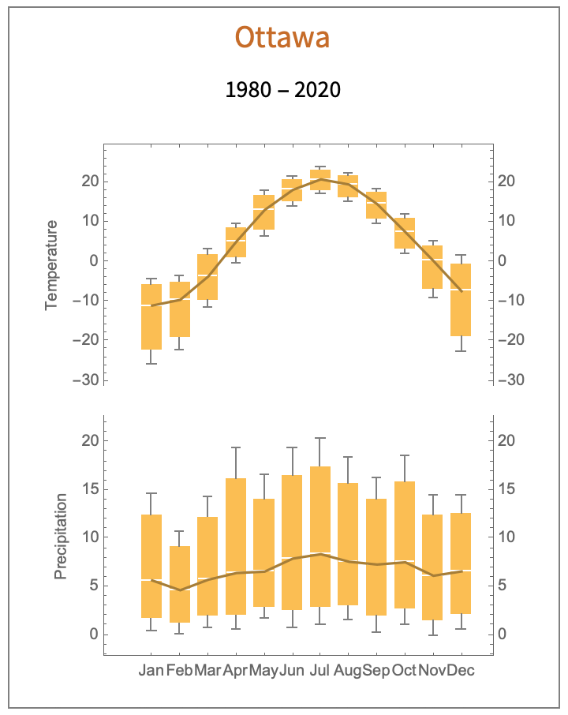
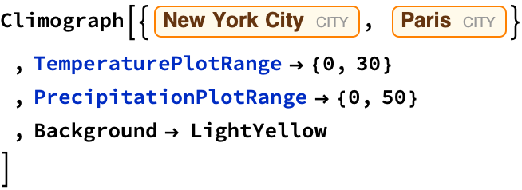
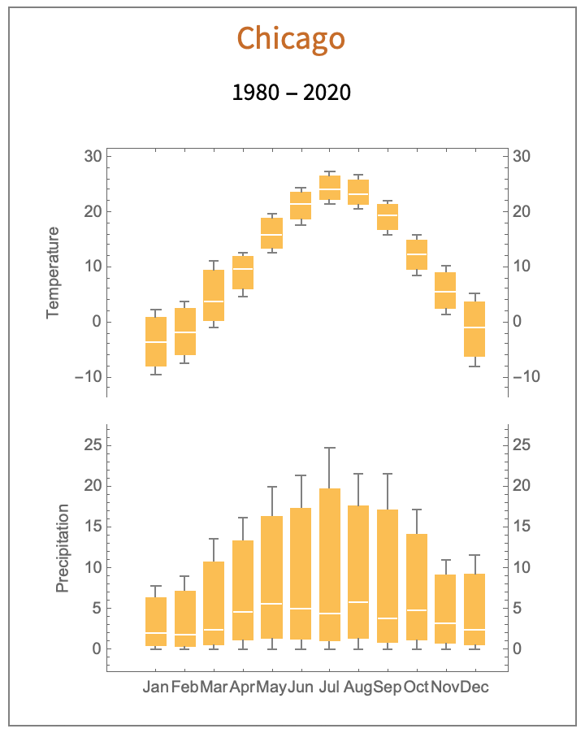
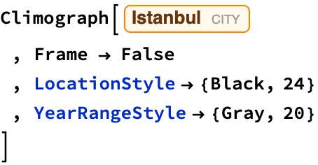
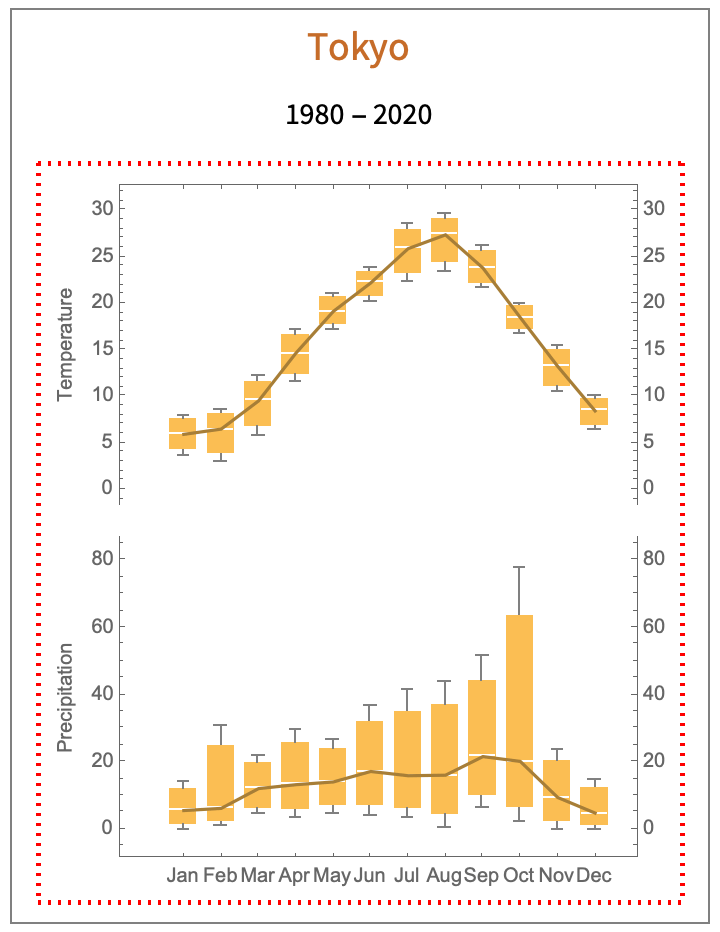

# Climograph

 Steven Black Project home: https://github.com/StevenBlack/climographs

## Introduction

 The motivation for this repository is, given a location, create its clomograph.

 See: https://en.wikipedia.org/wiki/Climograph.

### Examples (images)

 **Example: **You can pass a single location Entity and get its climograph.

 

 

 **Example: **You can pass a list of&nbsp;&nbsp;location Entities and get a list of their climographs.

 

## The Code

 

## Live Examples

 **Example 1**: This call with no options produces a default climograph.

 

 
<map name="map_6">
<area shape="rect" coords="288,438,305,339" title="max      32.64

75%      27.9016

median   13.6865

25%      3.42163

min      0." nohref="" />
<area shape="rect" coords="268,438,285,294" title="max      48.

75%      40.2491

median   16.9965

25%      4.24913

min      0." nohref="" />
<area shape="rect" coords="248,438,265,336" title="max      33.64

75%      27.9427

median   10.8509

25%      2.71273

min      0." nohref="" />
<area shape="rect" coords="227,438,244,370" title="max      22.02

75%      17.7881

median   5.09233

25%      1.27308

min      0." nohref="" />
<area shape="rect" coords="207,438,224,387" title="max      16.17

75%      12.8667

median   2.95698

25%      0.739244

min      0." nohref="" />
<area shape="rect" coords="187,438,204,413" title="max      7.3

75%      6.05523

median   2.32093

25%      0.580233

min      0." nohref="" />
<area shape="rect" coords="167,438,184,398" title="max      12.57

75%      10.4487

median   4.08488

25%      1.02122

min      0." nohref="" />
<area shape="rect" coords="147,438,164,389" title="max      15.52

75%      13.0244

median   5.53767

25%      1.38442

min      0." nohref="" />
<area shape="rect" coords="127,438,144,382" title="max      17.88

75%      15.2486

median   7.35429

25%      1.83857

min      0." nohref="" />
<area shape="rect" coords="107,438,124,329" title="max      35.96

75%      29.6864

median   10.8657

25%      2.71643

min      0." nohref="" />
<area shape="rect" coords="87,438,103,375" title="max      20.28

75%      17.1847

median   7.89881

25%      1.9747

min      0." nohref="" />
<area shape="rect" coords="66,438,83,325" title="max      37.26

75%      31.5745

median   14.5179

25%      3.62948

min      0." nohref="" />
<area shape="rect" coords="288,248,305,208" title="max      6.28

75%      5.87116

median   4.64465

25%      1.79116

min      0.84" nohref="" />
<area shape="rect" coords="268,242,285,186" title="max      9.52

75%      8.93895

median   7.19581

25%      3.14145

min      1.79" nohref="" />
<area shape="rect" coords="248,190,265,163" title="max      12.94

75%      12.4374

median   10.9295

25%      9.81988

min      9.45" nohref="" />
<area shape="rect" coords="227,160,244,137" title="max      16.76

75%      16.3862

median   15.2647

25%      14.1887

min      13.83" nohref="" />
<area shape="rect" coords="207,142,224,114" title="max      20.12

75%      19.6932

median   18.4128

25%      16.8957

min      16.39" nohref="" />
<area shape="rect" coords="187,146,204,107" title="max      21.1

75%      20.4167

median   18.3667

25%      16.5092

min      15.89" nohref="" />
<area shape="rect" coords="167,159,184,125" title="max      18.56

75%      17.8892

median   15.8767

25%      14.4617

min      13.99" nohref="" />
<area shape="rect" coords="147,186,164,147" title="max      15.28

75%      14.752

median   13.1679

25%      10.822

min      10.04" nohref="" />
<area shape="rect" coords="127,213,144,168" title="max      12.24

75%      11.6322

median   9.80884

25%      7.01221

min      6.08" nohref="" />
<area shape="rect" coords="107,221,124,187" title="max      9.4

75%      8.87744

median   7.30977

25%      5.47244

min      4.86" nohref="" />
<area shape="rect" coords="87,250,103,194" title="max      8.36

75%      7.61413

median   5.37651

25%      1.80163

min      0.61" nohref="" />
<area shape="rect" coords="66,251,83,198" title="max      7.8

75%      7.07081

median   4.88326

25%      1.55081

min      0.44" nohref="" />
</map>

 **Example 2**: This call uses options to set the background color, and normalizes the vertical ranges for both the temperature and precipitation plots.

 

 
<map name="map_8">
<area shape="rect" coords="669,446,686,403" title="max      12.71

75%      10.7001

median   4.67049

25%      1.16762

min      0." nohref="" />
<area shape="rect" coords="649,446,666,414" title="max      9.3

75%      7.92756

median   3.81025

25%      0.952563

min      0." nohref="" />
<area shape="rect" coords="629,446,646,387" title="max      18.04

75%      14.6942

median   4.65692

25%      1.16423

min      0." nohref="" />
<area shape="rect" coords="608,446,625,387" title="max      18.02

75%      14.4746

median   3.83821

25%      0.959551

min      0." nohref="" />
<area shape="rect" coords="588,446,605,410" title="max      10.45

75%      8.7473

median   3.63921

25%      0.909803

min      0." nohref="" />
<area shape="rect" coords="568,446,585,407" title="max      11.63

75%      9.73822

median   4.06289

25%      1.01572

min      0." nohref="" />
<area shape="rect" coords="548,446,565,392" title="max      16.51

75%      13.6238

median   4.965

25%      1.24125

min      0." nohref="" />
<area shape="rect" coords="528,446,545,332" title="max      35.86

75%      28.3458

median   5.80325

25%      1.45081

min      0." nohref="" />
<area shape="rect" coords="508,446,525,412" title="max      9.83

75%      8.08963

median   2.86854

25%      0.717134

min      0." nohref="" />
<area shape="rect" coords="488,446,505,404" title="max      12.42

75%      10.2688

median   3.81512

25%      0.95378

min      0." nohref="" />
<area shape="rect" coords="468,446,484,410" title="max      10.71

75%      8.8659

median   3.33359

25%      0.833397

min      0." nohref="" />
<area shape="rect" coords="447,446,464,407" title="max      11.44

75%      9.50969

median   3.71875

25%      0.929688

min      0." nohref="" />
<area shape="rect" coords="669,255,686,206" title="max      9.65

75%      8.58151

median   5.37605

25%      1.92901

min      0.78" nohref="" />
<area shape="rect" coords="649,238,666,196" title="max      11.72

75%      10.7694

median   7.91744

25%      4.99436

min      4.02" nohref="" />
<area shape="rect" coords="629,209,646,175" title="max      15.68

75%      14.9056

median   12.5823

25%      10.4131

min      9.69" nohref="" />
<area shape="rect" coords="608,187,625,156" title="max      19.36

75%      18.6481

median   16.5126

25%      14.5456

min      13.89" nohref="" />
<area shape="rect" coords="588,175,605,132" title="max      24.12

75%      23.0809

median   19.9635

25%      17.2609

min      16.36" nohref="" />
<area shape="rect" coords="568,174,585,133" title="max      23.86

75%      22.9548

median   20.2393

25%      17.3448

min      16.38" nohref="" />
<area shape="rect" coords="548,200,565,148" title="max      20.98

75%      20.1919

median   17.8277

25%      13.0294

min      11.43" nohref="" />
<area shape="rect" coords="528,201,545,165" title="max      17.57

75%      16.8559

median   14.7135

25%      12.1834

min      11.34" nohref="" />
<area shape="rect" coords="508,218,525,179" title="max      14.9

75%      13.9253

median   11.0012

25%      8.64529

min      7.86" nohref="" />
<area shape="rect" coords="488,235,505,199" title="max      11.06

75%      10.3509

median   8.22372

25%      5.61093

min      4.74" nohref="" />
<area shape="rect" coords="468,266,484,208" title="max      9.41

75%      8.35453

median   5.18814

25%      0.262035

min      -1.38" nohref="" />
<area shape="rect" coords="447,268,464,215" title="max      8.07

75%      7.19645

median   4.57581

25%      -0.183547

min      -1.77" nohref="" />
<area shape="rect" coords="296,444,313,377" title="max      21.21

75%      18.185

median   9.11

25%      2.6825

min      0.54" nohref="" />
<area shape="rect" coords="276,441,293,372" title="max      22.79

75%      19.1488

median   8.22535

25%      3.28634

min      1.64" nohref="" />
<area shape="rect" coords="256,444,273,357" title="max      27.61

75%      22.8805

median   8.69209

25%      2.54802

min      0.5" nohref="" />
<area shape="rect" coords="235,442,252,368" title="max      24.15

75%      20.2327

median   8.4807

25%      3.03517

min      1.22" nohref="" />
<area shape="rect" coords="215,444,232,307" title="max      43.71

75%      35.146

median   9.45419

25%      2.77605

min      0.55" nohref="" />
<area shape="rect" coords="195,446,212,351" title="max      29.73

75%      24.6595

median   9.44814

25%      2.37703

min      0.02" nohref="" />
<area shape="rect" coords="175,446,192,366" title="max      24.8

75%      20.8031

median   8.81256

25%      2.21814

min      0.02" nohref="" />
<area shape="rect" coords="155,443,172,358" title="max      27.46

75%      22.9873

median   9.5693

25%      2.94733

min      0.74" nohref="" />
<area shape="rect" coords="135,441,152,363" title="max      25.89

75%      21.7233

median   9.22326

25%      3.32581

min      1.36" nohref="" />
<area shape="rect" coords="115,444,132,372" title="max      22.74

75%      19.3031

median   8.99233

25%      2.64558

min      0.53" nohref="" />
<area shape="rect" coords="95,442,111,396" title="max      14.98

75%      12.868

median   6.53209

25%      2.55552

min      1.23" nohref="" />
<area shape="rect" coords="74,442,91,380" title="max      20.27

75%      17.1756

median   7.89233

25%      2.87308

min      1.2" nohref="" />
<area shape="rect" coords="296,275,313,205" title="max      9.86

75%      8.29587

median   3.60349

25%      -1.43913

min      -3.12" nohref="" />
<area shape="rect" coords="276,231,293,200" title="max      10.97

75%      10.3698

median   8.56907

25%      6.28977

min      5.53" nohref="" />
<area shape="rect" coords="256,200,273,168" title="max      17.08

75%      16.3597

median   14.1988

25%      12.1672

min      11.49" nohref="" />
<area shape="rect" coords="235,164,252,141" title="max      22.25

75%      21.7242

median   20.147

25%      18.8292

min      18.39" nohref="" />
<area shape="rect" coords="215,144,232,126" title="max      25.27

75%      24.8598

median   23.6293

25%      22.5573

min      22.2" nohref="" />
<area shape="rect" coords="195,145,212,124" title="max      25.62

75%      25.2287

median   24.0547

25%      22.6037

min      22.12" nohref="" />
<area shape="rect" coords="175,161,192,138" title="max      22.94

75%      22.3806

median   20.7023

25%      19.4706

min      19.06" nohref="" />
<area shape="rect" coords="155,190,172,161" title="max      18.49

75%      17.7245

median   15.4281

25%      13.892

min      13.38" nohref="" />
<area shape="rect" coords="135,221,152,193" title="max      12.18

75%      11.6788

median   10.1751

25%      8.08628

min      7.39" nohref="" />
<area shape="rect" coords="115,247,132,215" title="max      8.01

75%      7.27052

median   5.05209

25%      3.01052

min      2.33" nohref="" />
<area shape="rect" coords="95,279,111,234" title="max      4.24

75%      3.5625

median   1.53

25%      -2.5725

min      -3.94" nohref="" />
<area shape="rect" coords="74,279,91,236" title="max      4.01

75%      3.145

median   0.55

25%      -2.7275

min      -3.82" nohref="" />
</map>

 **Example 3**: This call uses options to omit the lines joining temperature and precipitation mean values.

 

 
<map name="map_10">
<area shape="rect" coords="283,423,300,358" title="max      11.58

75%      9.33432

median   2.5973

25%      0.649324

min      0." nohref="" />
<area shape="rect" coords="264,423,280,360" title="max      11.07

75%      9.12694

median   3.29778

25%      0.824444

min      0." nohref="" />
<area shape="rect" coords="245,423,261,327" title="max      17.28

75%      14.2177

median   5.03081

25%      1.2577

min      0." nohref="" />
<area shape="rect" coords="225,423,242,303" title="max      21.6

75%      17.156

median   3.82395

25%      0.955987

min      0." nohref="" />
<area shape="rect" coords="206,423,223,303" title="max      21.59

75%      17.6298

median   5.74919

25%      1.4373

min      0." nohref="" />
<area shape="rect" coords="187,423,203,286" title="max      24.83

75%      19.7795

median   4.62816

25%      1.15704

min      0." nohref="" />
<area shape="rect" coords="168,423,184,304" title="max      21.46

75%      17.4244

median   5.31763

25%      1.32941

min      0." nohref="" />
<area shape="rect" coords="148,423,165,312" title="max      19.97

75%      16.4077

median   5.72077

25%      1.43019

min      0." nohref="" />
<area shape="rect" coords="129,423,146,332" title="max      16.27

75%      13.3847

median   4.72868

25%      1.18217

min      0." nohref="" />
<area shape="rect" coords="110,423,126,347" title="max      13.55

75%      10.8217

median   2.63684

25%      0.659211

min      0." nohref="" />
<area shape="rect" coords="91,423,107,372" title="max      9.01

75%      7.24885

median   1.96538

25%      0.491346

min      0." nohref="" />
<area shape="rect" coords="71,423,88,378" title="max      7.79

75%      6.37

median   2.11

25%      0.5275

min      0." nohref="" />
<area shape="rect" coords="283,238,300,187" title="max      5.14

75%      3.65703

median   -0.79186

25%      -6.22047

min      -8.03" nohref="" />
<area shape="rect" coords="264,203,280,169" title="max      10.18

75%      9.00901

median   5.49605

25%      2.51401

min      1.52" nohref="" />
<area shape="rect" coords="245,178,261,148" title="max      15.82

75%      14.964

median   12.396

25%      9.55651

min      8.61" nohref="" />
<area shape="rect" coords="225,151,242,126" title="max      22.06

75%      21.3808

median   19.343

25%      16.7758

min      15.92" nohref="" />
<area shape="rect" coords="206,133,223,108" title="max      26.75

75%      25.8999

median   23.3495

25%      21.3624

min      20.7" nohref="" />
<area shape="rect" coords="187,130,203,106" title="max      27.38

75%      26.5934

median   24.2335

25%      22.2584

min      21.6" nohref="" />
<area shape="rect" coords="168,144,184,117" title="max      24.3

75%      23.5906

median   21.4626

25%      18.7081

min      17.79" nohref="" />
<area shape="rect" coords="148,163,165,134" title="max      19.84

75%      18.8602

median   15.9209

25%      13.4527

min      12.63" nohref="" />
<area shape="rect" coords="129,192,146,160" title="max      12.7

75%      11.9717

median   9.78674

25%      5.98669

min      4.72" nohref="" />
<area shape="rect" coords="110,212,126,165" title="max      11.28

75%      9.41977

median   3.83907

25%      0.322267

min      -0.85" nohref="" />
<area shape="rect" coords="91,236,107,192" title="max      3.86

75%      2.43651

median   -1.83395

25%      -5.96349

min      -7.34" nohref="" />
<area shape="rect" coords="71,244,88,197" title="max      2.42

75%      0.924128

median   -3.56349

25%      -7.99337

min      -9.47" nohref="" />
</map>

 **Example 4**: This call uses options to not show an outer frame.

 

 
<map name="map_12">
<area shape="rect" coords="288,437,305,363" title="max      26.87

75%      22.346

median   8.77395

25%      2.41849

min      0.3" nohref="" />
<area shape="rect" coords="268,436,285,339" title="max      35.62

75%      28.5997

median   7.53884

25%      2.37221

min      0.65" nohref="" />
<area shape="rect" coords="248,437,265,294" title="max      52.6

75%      41.2894

median   7.35767

25%      2.15442

min      0.42" nohref="" />
<area shape="rect" coords="227,438,244,398" title="max      13.91

75%      11.3595

median   3.70814

25%      0.942035

min      0.02" nohref="" />
<area shape="rect" coords="207,438,224,330" title="max      39.18

75%      30.2348

median   3.39929

25%      0.849821

min      0." nohref="" />
<area shape="rect" coords="187,438,204,375" title="max      22.32

75%      17.3643

median   2.49721

25%      0.624302

min      0." nohref="" />
<area shape="rect" coords="167,438,184,355" title="max      29.82

75%      23.2184

median   3.41349

25%      0.853372

min      0." nohref="" />
<area shape="rect" coords="147,438,164,378" title="max      21.36

75%      16.9993

median   3.91721

25%      1.0168

min      0.05" nohref="" />
<area shape="rect" coords="127,436,144,399" title="max      13.2

75%      10.9556

median   4.22256

25%      1.43064

min      0.5" nohref="" />
<area shape="rect" coords="107,436,124,394" title="max      15.25

75%      12.8621

median   5.69837

25%      1.85209

min      0.57" nohref="" />
<area shape="rect" coords="87,435,103,369" title="max      24.53

75%      20.031

median   6.53395

25%      2.42099

min      1.05" nohref="" />
<area shape="rect" coords="66,435,83,375" title="max      22.46

75%      18.8066

median   7.84651

25%      2.73413

min      1.03" nohref="" />
<area shape="rect" coords="288,234,305,193" title="max      11.53

75%      10.7559

median   8.43349

25%      5.37087

min      4.35" nohref="" />
<area shape="rect" coords="268,218,285,167" title="max      16.65

75%      15.5113

median   12.0953

25%      8.63384

min      7.48" nohref="" />
<area shape="rect" coords="248,185,265,147" title="max      20.29

75%      19.3855

median   16.6721

25%      14.4355

min      13.69" nohref="" />
<area shape="rect" coords="227,161,244,126" title="max      24.32

75%      23.5623

median   21.2891

25%      18.9948

min      18.23" nohref="" />
<area shape="rect" coords="207,144,224,107" title="max      27.95

75%      27.2178

median   25.0214

25%      22.4328

min      21.57" nohref="" />
<area shape="rect" coords="187,142,204,110" title="max      27.44

75%      26.7913

median   24.8453

25%      22.6288

min      21.89" nohref="" />
<area shape="rect" coords="167,152,184,122" title="max      25.16

75%      24.4239

median   22.2156

25%      20.4639

min      19.88" nohref="" />
<area shape="rect" coords="147,182,164,149" title="max      20.05

75%      19.3713

median   17.3353

25%      15.0813

min      14.33" nohref="" />
<area shape="rect" coords="127,209,144,168" title="max      16.47

75%      15.4542

median   12.4067

25%      9.88919

min      9.05" nohref="" />
<area shape="rect" coords="107,239,124,189" title="max      12.44

75%      11.3671

median   8.14837

25%      4.63209

min      3.46" nohref="" />
<area shape="rect" coords="87,251,103,201" title="max      10.17

75%      9.18953

median   6.24814

25%      2.38703

min      1.1" nohref="" />
<area shape="rect" coords="66,239,83,206" title="max      9.09

75%      8.37035

median   6.2114

25%      4.08035

min      3.37" nohref="" />
</map>

 **Example 5**: This call uses options to show the inner frame with a particular style.

 

 
<map name="map_14">
<area shape="rect" coords="288,438,305,409" title="max      14.52

75%      12.1549

median   5.05977

25%      1.26494

min      0." nohref="" />
<area shape="rect" coords="268,438,285,392" title="max      23.64

75%      20.1078

median   9.5114

25%      2.41535

min      0.05" nohref="" />
<area shape="rect" coords="248,434,265,294" title="max      77.98

75%      63.491

median   20.0242

25%      6.46105

min      1.94" nohref="" />
<area shape="rect" coords="227,426,244,342" title="max      51.55

75%      44.1495

median   21.9481

25%      10.1745

min      6.25" nohref="" />
<area shape="rect" coords="207,436,224,356" title="max      43.78

75%      36.9665

median   16.526

25%      4.61901

min      0.65" nohref="" />
<area shape="rect" coords="187,432,204,360" title="max      41.27

75%      35.08

median   16.51

25%      6.475

min      3.13" nohref="" />
<area shape="rect" coords="167,431,184,368" title="max      36.81

75%      31.8605

median   17.0119

25%      7.08797

min      3.78" nohref="" />
<area shape="rect" coords="147,429,164,386" title="max      26.85

75%      23.6628

median   14.1012

25%      7.18529

min      4.88" nohref="" />
<area shape="rect" coords="127,431,144,381" title="max      29.62

75%      25.6148

median   13.5991

25%      6.05477

min      3.54" nohref="" />
<area shape="rect" coords="107,430,124,395" title="max      22.12

75%      19.6488

median   12.2351

25%      6.35128

min      4.39" nohref="" />
<area shape="rect" coords="87,436,103,379" title="max      30.78

75%      24.6694

median   6.33767

25%      2.29692

min      0.95" nohref="" />
<area shape="rect" coords="66,438,83,409" title="max      14.01

75%      11.8828

median   5.50116

25%      1.41279

min      0.05" nohref="" />
<area shape="rect" coords="288,226,305,204" title="max      10.15

75%      9.72721

median   8.45884

25%      6.90721

min      6.39" nohref="" />
<area shape="rect" coords="268,206,285,177" title="max      15.54

75%      14.988

median   13.3321

25%      11.178

min      10.46" nohref="" />
<area shape="rect" coords="248,174,265,155" title="max      20.09

75%      19.6908

median   18.4933

25%      17.2458

min      16.83" nohref="" />
<area shape="rect" coords="227,150,244,124" title="max      26.17

75%      25.5879

median   23.8416

25%      22.1904

min      21.64" nohref="" />
<area shape="rect" coords="207,141,224,107" title="max      29.63

75%      29.0814

median   27.4356

25%      24.4389

min      23.44" nohref="" />
<area shape="rect" coords="187,146,204,112" title="max      28.58

75%      27.9309

median   25.9835

25%      23.3109

min      22.42" nohref="" />
<area shape="rect" coords="167,157,184,136" title="max      23.8

75%      23.4227

median   22.2909

25%      20.7752

min      20.27" nohref="" />
<area shape="rect" coords="147,172,164,149" title="max      21.15

75%      20.6634

median   19.2037

25%      17.7534

min      17.27" nohref="" />
<area shape="rect" coords="127,200,144,169" title="max      17.2

75%      16.5863

median   14.7453

25%      12.4613

min      11.7" nohref="" />
<area shape="rect" coords="107,229,124,190" title="max      12.94

75%      12.1263

median   9.68535

25%      6.83884

min      5.89" nohref="" />
<area shape="rect" coords="87,243,103,212" title="max      8.62

75%      8.10558

median   6.56233

25%      3.91308

min      3.03" nohref="" />
<area shape="rect" coords="66,239,83,215" title="max      8.04

75%      7.51552

median   5.94209

25%      4.28302

min      3.73" nohref="" />
</map>

 <a href="http://www.wolfram.com/language/" style="color:#000; text-decoration:none;">
  Created with the Wolfram Language 
 </a>

